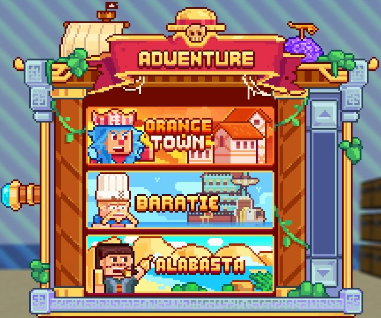

# 🏝️ Adventure Islands


**Adventure Islands Guide**


## <mark style="color:orange;">Functioning of Adventure Islands</mark>

<mark style="color:yellow;">**Adventure Islands**</mark> are a <mark style="color:yellow;">**key element**</mark> in <mark style="color:yellow;">**advancing**</mark> players toward their ultimate quest for the <mark style="color:yellow;">**Pirate King**</mark>.

Each island becomes <mark style="color:yellow;">**accessible**</mark> from a <mark style="color:yellow;">**specific rank**</mark>, and exploring them is essential to unlock <mark style="color:yellow;">**new achievements**</mark>, <mark style="color:yellow;">**new items**</mark> in <mark style="color:yellow;">**`/shop`**</mark>, and new <mark style="color:yellow;">**weapons**</mark> and <mark style="color:yellow;">**tools**</mark>. Here are some key pieces of information about these islands.&#x20;

All islands are <mark style="color:yellow;">**integrated**</mark> into the same <mark style="color:yellow;">**open world**</mark>, <mark style="color:yellow;">**accessible**</mark> by navigating with your <mark style="color:yellow;">**ships**</mark>. To facilitate movement, <mark style="color:yellow;">**poneglyphs**</mark> are <mark style="color:yellow;">**available for purchase**</mark> on each island, providing a quick option to <mark style="color:yellow;">**return**</mark>.&#x20;

* Use <mark style="color:yellow;">**`/adventure`**</mark> to see the <mark style="color:yellow;">**list of accessible islands**</mark> and move quickly between them.&#x20;
* Use <mark style="color:yellow;">**`/quest`**</mark> to get an overview of the <mark style="color:yellow;">**different quests**</mark> available on the current island.&#x20;


Explore the vast <mark style="color:yellow;">**open world**</mark>, use <mark style="color:yellow;">**poneglyphs**</mark> for quick navigation, and immerse yourself in the adventure to become the <mark style="color:yellow;">**Pirate King**</mark>!


<figure><figcaption>
<strong>Overview of the </strong><mark style="color:yellow;"><strong><code>/adventure</code></strong></mark><strong> Menu</strong>
</figcaption></figure>

Once the <mark style="color:yellow;">**`/adventure`**</mark> menu is opened, you can <mark style="color:yellow;">**access**</mark> different <mark style="color:yellow;">**information**</mark> by <mark style="color:yellow;">**left-clicking**</mark> on the respective <mark style="color:yellow;">**island**</mark>.&#x20;

<mark style="color:yellow;">**Drop Rates**</mark>: This icon informs you about the drop rates of different loots available on the island.&#x20;

<mark style="color:yellow;">**Achievements**</mark>: The second icon displays achievements specific to the island, allowing players to track their progress.&#x20;

<mark style="color:yellow;">**Special Shop**</mark>: The third icon provides access to a special shop where you can buy and sell items not available in the basic shop.&#x20;

<mark style="color:yellow;">**Item Recycler**</mark>: The last icon allows you to exchange items obtained in the island's chests for money.

<figure><figcaption>
<strong>Overview of the Menus of Different Islands</strong>
</figcaption></figure>

### <mark style="color:orange;">Currency and Loot</mark>

On each island, players face various <mark style="color:yellow;">**mobs**</mark>, <mark style="color:yellow;">**mini-bosses**</mark>, and <mark style="color:yellow;">**bosses**</mark> that drop <mark style="color:yellow;">**specific currency**</mark> and one <mark style="color:yellow;">**island-specific item**</mark> necessary to pursue their <mark style="color:yellow;">**achievements**</mark>. This currency is crucial for buying <mark style="color:yellow;">**crates**</mark> present on the island. Each island offers two types of chests: one available with the <mark style="color:yellow;">**island's currency**</mark> and another accessible with <mark style="color:green;">**Gems**</mark>.

### <mark style="color:orange;">Activities Unique to Each Island</mark>

Some <mark style="color:yellow;">**adventure islands**</mark> offer <mark style="color:yellow;">**unique activities**</mark>, detailed in <mark style="color:yellow;">**specific sections**</mark> for each island. These activities add diversity to the gaming experience.

### <mark style="color:orange;">Achievements and Progression</mark>

<mark style="color:yellow;">**Achievements**</mark> accomplished on these islands, combined with those from your personal island, are crucial for <mark style="color:yellow;">**ranking up**</mark>. They unlock <mark style="color:yellow;">**significant improvements**</mark> to enrich your gameplay.

By exploring the <mark style="color:yellow;">**Adventure Islands**</mark>, players can take on <mark style="color:yellow;">**challenges**</mark>, earn <mark style="color:yellow;">**rewards**</mark>, and <mark style="color:yellow;">**enhance**</mark> their character in the pursuit of becoming <mark style="color:yellow;">**the Pirate King**</mark>.&#x20;


Each <mark style="color:yellow;">**island**</mark> offers a <mark style="color:yellow;">**unique experience**</mark> and contributes to the <mark style="color:yellow;">**evolution**</mark> of your <mark style="color:yellow;">**adventure**</mark>.

