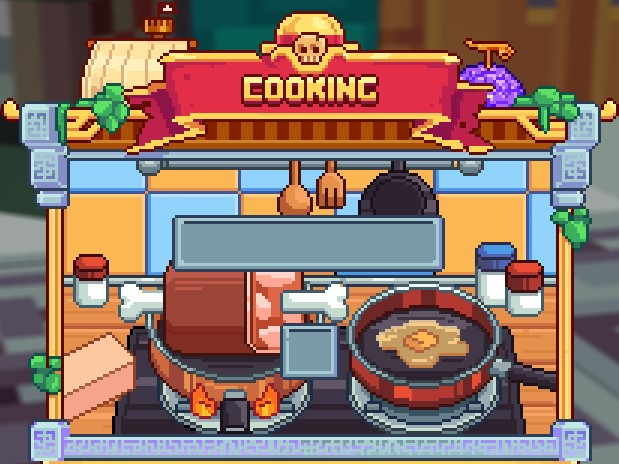

# 🍽️ Baratie

<figure><figcaption>
<strong>Overview of Baratie Island</strong>
</figcaption></figure>

## <mark style="color:orange;">**General Information**</mark>

<mark style="color:yellow;">**Baratie Adventure Island**</mark> becomes <mark style="color:yellow;">**accessible**</mark> after reaching the rank of "<mark style="color:yellow;">**Pirate**</mark>". To access it, take the helm of your <mark style="color:yellow;">**ship**</mark> from <mark style="color:yellow;">**Foosha**</mark> or <mark style="color:yellow;">**Orange Town**</mark> and set sail in search of <mark style="color:yellow;">**new**</mark> <mark style="color:yellow;">**challenges**</mark> worthy of a true pirate.&#x20;

On this <mark style="color:yellow;">**island**</mark>, new challenges await you, as battles are not on the agenda. Instead, your <mark style="color:yellow;">**culinary talent**</mark> will be put to the test, and you'll have to <mark style="color:yellow;">**fish**</mark> the <mark style="color:yellow;">**enormous fish of Baratie**</mark> and then <mark style="color:yellow;">**cook**</mark> them in the style of the true <mark style="color:yellow;">**chef Sanji**</mark>. If the customers are satisfied, you will be <mark style="color:yellow;">**rewarded in pans**</mark>, the <mark style="color:yellow;">**currency specific**</mark> to the island.&#x20;

These <mark style="color:yellow;">**pans**</mark> will allow you to <mark style="color:yellow;">**open the crate on the island**</mark>, unlocking <mark style="color:yellow;">**essential rewards**</mark> for your <mark style="color:yellow;">**progression**</mark>. The <mark style="color:yellow;">**premium chest**</mark> is also available for purchase with <mark style="color:green;">**gems**</mark>.

## <mark style="color:orange;">**Activity**</mark>

As for <mark style="color:yellow;">**activities**</mark> on this <mark style="color:yellow;">**island**</mark>, no need to fight. To continue your adventure, <mark style="color:yellow;">**develop your culinary skills**</mark>! In the <mark style="color:yellow;">**basement**</mark> of the <mark style="color:yellow;">**Baratie**</mark> restaurant, <mark style="color:yellow;">**cook**</mark> the <mark style="color:yellow;">**fish**</mark> needed for the <mark style="color:yellow;">**island's special recipes**</mark>.

<figure><figcaption></figcaption></figure>

Once the <mark style="color:yellow;">**fish is cooked**</mark>, prepare the <mark style="color:yellow;">**dishes**</mark> with the <mark style="color:yellow;">**required ingredients**</mark>, and you're good to go!


Take advantage of this island to strengthen your character and progress in your quest to become the Pirate King!


## <mark style="color:orange;">Assembly</mark>

To discover the <mark style="color:yellow;">**exclusive recipes**</mark> of the island, simply head to the <mark style="color:yellow;">**kitchen**</mark> and <mark style="color:yellow;">**click**</mark> on one of the blocks <mark style="color:yellow;">**located**</mark> next to the <mark style="color:yellow;">**cooking stoves**</mark>. By doing so, a dedicated <mark style="color:yellow;">**interface**</mark> will open, revealing the <mark style="color:yellow;">**elements necessary**</mark> for your creations.

<figure><figcaption>
<strong>Assembly overview</strong>
</figcaption></figure>

#### <mark style="color:orange;">How to Access Recipes</mark>

<mark style="color:yellow;">**Head to the Kitchen**</mark> : Make your way to the island's kitchen, a magical place where unique concoctions are prepared.&#x20;

<mark style="color:yellow;">**Click on the Block**</mark> : Next to the cooking stoves, you will find interactive blocks. Click on one of them to open the recipe menu.

#### <mark style="color:orange;">Follow the Steps</mark>

<mark style="color:yellow;">**Intuitive Interface**</mark> : Once the block is selected, an intuitive user interface will appear, displaying the different available recipes.&#x20;

<mark style="color:yellow;">**Ingredients and Steps**</mark> : Each recipe will list the necessary ingredients and the steps to follow. The ingredients will be clearly displayed, allowing you to check what you need.&#x20;

<mark style="color:yellow;">**Check Your Inventory**</mark> : Before starting to assemble the recipe, make sure you have the necessary items in your inventory. The required items must be present to be able to select the recipe.&#x20;

<mark style="color:yellow;">**Pre-cooking Fish**</mark> : For recipes involving fish, note that they must first be cooked. Place the fish in the cooking stove interface and wait a few moments for it to be cooked and ready to be used in your recipes.

<figure><figcaption>
<strong>Overview of the Cooking interface</strong>
</figcaption></figure>

<mark style="color:yellow;">**Cook with Ease**</mark> : Follow the step-by-step instructions to create the culinary delights of the island. You will be guided through the process, ensuring a hassle-free cooking experience.

### <mark style="color:orange;">Recipes</mark>

<mark style="color:yellow;">**Lionfish Temaki**</mark> **:**&#x20;

* **Cooked lionfish**
* **Rose**
* **Carrot**

<mark style="color:blue;">**Bette Kabuki**</mark>** :**&#x20;

* **Cooked Fighting Fish**
* **Wheat**
* **Potato**

<mark style="color:purple;">**Captain Lobster**</mark> **:** &#x20;

* **Cooked red lobster**
* **Bottle of Water**&#x20;
* **Beetroot**

&#x20;<mark style="color:yellow;">**Tako Tako Surprise**</mark>** :**&#x20;

* **Cooked octopus**
* **Brown mushroom**
* **Sweet berries**

<mark style="color:blue;">**Thousand Sunny Maki**</mark> **:**&#x20;

* **Cooked butterfly fish**
* **Dried Kelp**
* **Peony**

## <mark style="color:orange;">Boss</mark>

In the <mark style="color:yellow;">**adventure zone**</mark>, the <mark style="color:yellow;">**Monster of the Seas**</mark> statue awaits. In exchange for <mark style="color:yellow;">**sea horns**</mark>, frying <mark style="color:yellow;">**pans**</mark>, and <mark style="color:yellow;">**money**</mark>, summon the <mark style="color:yellow;">**boss**</mark> for an epic battle and collect the <mark style="color:yellow;">**rewards**</mark> that follow.

## <mark style="color:orange;">**Baratie Crate**</mark>

The <mark style="color:yellow;">**Baratie Crate**</mark> can be obtained by purchasing it for the price of <mark style="color:yellow;">**2,000 Pans**</mark>.

<figure><figcaption>
<strong>Overview of the Baratie Crate</strong>
</figcaption></figure>

|                         **Rewards**                        | **Drop Rate** |
| :--------------------------------------------------------: | :-----------: |
| <mark style="color:yellow;">**1x Sale Dials (1.2)**</mark> |    **22%**    |
|      <mark style="color:green;">**Pet Chopper**</mark>     |    **22%**    |
|  <mark style="color:green;">**Cook's Fishing Rod**</mark>  |    **22%**    |
|     <mark style="color:green;">**Gin's Tonfas**</mark>     |     **6%**    |
|   <mark style="color:yellow;">**Fullbody's Sword**</mark>  |     **6%**    |
|     <mark style="color:yellow;">**Job Booster**</mark>     |    **10%**    |
|        <mark style="color:green;">**Sponge**</mark>        |     **4%**    |
|    <mark style="color:yellow;">**Pet Don Krieg**</mark>    |     **3%**    |
|      <mark style="color:green;">**Kilo Fruit**</mark>      |     **1%**    |

## <mark style="color:orange;">**Premium Baratie Crate**</mark>

The <mark style="color:yellow;">**Premium Baratie Crate**</mark> can be obtained by purchasing it for the price of <mark style="color:green;">**290 Gems**</mark>.

<figure><figcaption>
<strong>Overview of the Premium Baratie Crate</strong>
</figcaption></figure>

|                         **Rewards**                        | **Drop Rate** |
| :--------------------------------------------------------: | :-----------: |
|  <mark style="color:blue;">**1x Sale Dials (1.4)**</mark>  |    **23%**    |
|       <mark style="color:green;">**Pet Sanji**</mark>      |    **20%**    |
| <mark style="color:green;">**Crocus's Fishing Rod**</mark> |    **10%**    |
|  <mark style="color:yellow;">**Don Krieg's Spear**</mark>  |     **6%**    |
|       <mark style="color:green;">**Meatball**</mark>       |     **6%**    |
|     <mark style="color:yellow;">**Job Booster**</mark>     |    **10%**    |
|        <mark style="color:green;">**Sponge**</mark>        |    **10%**    |
|       <mark style="color:blue;">**Pet Mihawk**</mark>      |     **3%**    |
|     <mark style="color:green;">**Spring Fruit**</mark>     |     **2%**    |


Opening three chests simultaneously is reserved for premium subscription holders.

