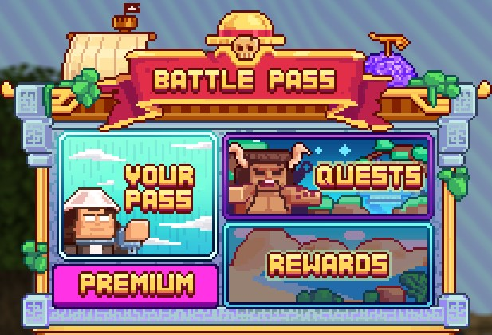

# 🗡️ Battle Pass


**Earning Money on MinePiece**


To <mark style="color:yellow;">**enhance**</mark> your <mark style="color:yellow;">**experience**</mark>, we've introduced a <mark style="color:yellow;">**Battle Pass**</mark> on the server.&#x20;

Its <mark style="color:yellow;">**goal**</mark> is to offer you the opportunity to <mark style="color:yellow;">**win rewards**</mark> by completing <mark style="color:yellow;">**monthly quests**</mark>.&#x20;

The <mark style="color:yellow;">**Battle Pass**</mark> is <mark style="color:yellow;">**reset every month**</mark>, allowing you to take on challenges within the specified <mark style="color:yellow;">**timeframe**</mark>.

<figure><figcaption>
Menu <mark style="color:yellow;"><strong><code>/pass</code></strong></mark>
</figcaption></figure>

## <mark style="color:orange;">**Quests**</mark>

By accessing the <mark style="color:yellow;">**`/pass`**</mark> menu, you'll discover various elements, including the "<mark style="color:yellow;">**Quests**</mark>" tab, where you can <mark style="color:yellow;">**check the assigned missions**</mark>.&#x20;

<mark style="color:yellow;">**Each day**</mark>, you have the opportunity to <mark style="color:yellow;">**complete 8 quests**</mark>, distributed as follows:

* <mark style="color:green;">**4 easy quests**</mark>
* <mark style="color:orange;">**2 normal quests**</mark>
* <mark style="color:blue;">**2 hard quests**</mark>

These <mark style="color:yellow;">**quests**</mark> respectively <mark style="color:yellow;">**yield**</mark> <mark style="color:green;">**25**</mark>, <mark style="color:orange;">**50**</mark>, and <mark style="color:blue;">**100**</mark> <mark style="color:blue;">**points**</mark>, totaling <mark style="color:yellow;">**400 points per day**</mark>.&#x20;

The <mark style="color:yellow;">**8 quests**</mark> are evenly <mark style="color:yellow;">**distributed**</mark> between <mark style="color:yellow;">**quests on adventure islands**</mark> and those related to farming on your <mark style="color:yellow;">**personal island**</mark>, offering a variety of objectives to achieve.

<figure><figcaption>
<strong>Quests Tab Overview</strong>
</figcaption></figure>

## <mark style="color:orange;">**Rewards**</mark>

<mark style="color:yellow;">**Progression**</mark> in <mark style="color:yellow;">**quests**</mark> occurs in <mark style="color:yellow;">**tiers**</mark>. As you advance and <mark style="color:yellow;">**accumulate points**</mark>, you progress through the <mark style="color:yellow;">**50 available quest tiers**</mark>, obtaining significant <mark style="color:yellow;">**rewards**</mark> at <mark style="color:yellow;">**each stage**</mark>.&#x20;

Additionally, by opting for the <mark style="color:yellow;">**Premium Battle Pass**</mark>, you have the opportunity to unlock <mark style="color:yellow;">**extra rewards**</mark>.

<figure><figcaption>
<strong>Rewards Tab Overview</strong>
</figcaption></figure>

## <mark style="color:orange;">**Your Pass**</mark>

You can track your <mark style="color:yellow;">**Battle Pass progression**</mark> by accessing the "<mark style="color:yellow;">**Your Pass**</mark>" tab. There, you'll find the <mark style="color:yellow;">**completion percentage**</mark> of your <mark style="color:yellow;">**level**</mark> and the <mark style="color:yellow;">**remaining duration**</mark> of the <mark style="color:yellow;">**season**</mark>.

<figure><figcaption>
<strong>Your Pass Tab Overview</strong>
</figcaption></figure>

## <mark style="color:orange;">**Premium Subscription**</mark>

The <mark style="color:yellow;">**premium subscription**</mark> provides access to <mark style="color:yellow;">**additional rewards**</mark> while offering other <mark style="color:yellow;">**exclusive benefits**</mark> available through its purchase.&#x20;

To subscribe to this <mark style="color:yellow;">**service**</mark>, go to the [<mark style="color:yellow;">**store**</mark>](https://store.minepiece.net) and find below the <mark style="color:yellow;">**list of items**</mark> included in the <mark style="color:yellow;">**Premium**</mark> tab.

### <mark style="color:orange;">**List of Benefits**</mark>

* <mark style="color:green;">**1500 Gems**</mark>** ** _(Every month)_
* **No **<mark style="color:yellow;">**experience loss**</mark>** upon death**
* <mark style="color:yellow;">**Multi-launch**</mark>** of adventure crates**
* **No **<mark style="color:yellow;">**teleportation**</mark>** cooldown**
* **Unique **<mark style="color:yellow;">**color**</mark>** in chat**
* **Choice of **<mark style="color:yellow;">**highlight color**</mark>
* <mark style="color:yellow;">**Exclusive icon**</mark>** next to your username**
* **Access to **<mark style="color:yellow;">**`/kit premium`**</mark>  _(Every 72 hours)_
* **Colors in chat **<mark style="color:yellow;">**`/color`**</mark>
* **Colors in description **<mark style="color:yellow;">**`/pw`**</mark>
* **Access to **<mark style="color:yellow;">**`/emoji`**</mark>
* **Access to **<mark style="color:yellow;">**`/ec`**</mark>
* **Access to **<mark style="color:yellow;">**`/craft`**</mark>
* **Access to **<mark style="color:yellow;">**`/feed`**</mark>
* **Access to **<mark style="color:yellow;">**`/sell all`**</mark>
* **Access to **<mark style="color:yellow;">**`/hdb`**</mark>
* **Access to the **<mark style="color:yellow;">**Premium Pass**</mark>


Now, you are fully informed about the MinePiece Battle Pass!

