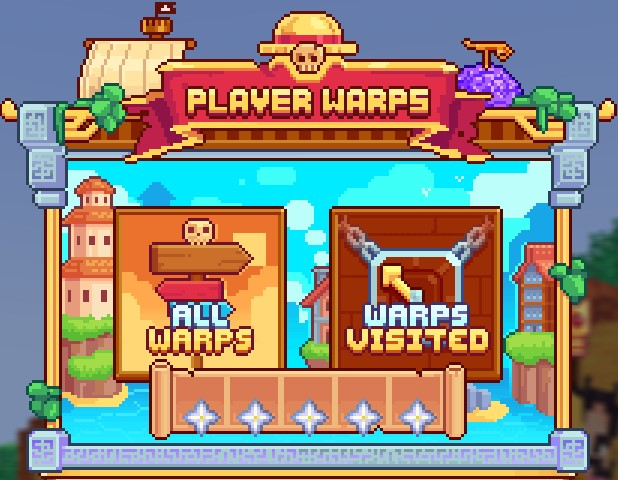

# 🏝️ Crews


**Crews & Islands**


On <mark style="color:yellow;">**MinePiece**</mark>, in addition to the adventure part, you have the possibility to create your <mark style="color:yellow;">**crew alone**</mark> or <mark style="color:yellow;">**with others**</mark> and thus own an island just for you and your crew.&#x20;

Your island will be useful for <mark style="color:yellow;">**storing**</mark> all your <mark style="color:yellow;">**resources**</mark>, creating your <mark style="color:yellow;">**fields**</mark> and <mark style="color:yellow;">**factories**</mark>, and becoming the best crew on <mark style="color:yellow;">**MinePiece**</mark>!

## <mark style="color:orange;">**Create Your Crew**</mark>

* If you want to <mark style="color:yellow;">**create**</mark> your own crew or go on an adventure solo, just use the command <mark style="color:yellow;">**`/is create [name]`**</mark>. Once this command is executed, you will be teleported directly to <mark style="color:yellow;">**your island**</mark>, and the adventure begins!\

* If you want to <mark style="color:yellow;">**join**</mark> <mark style="color:yellow;">**another player's**</mark> crew, they must first <mark style="color:yellow;">**invite**</mark> you to their island using the command <mark style="color:yellow;">**`/is invite [username]`**</mark>. You can then <mark style="color:yellow;">**accept**</mark> this invitation with the command <mark style="color:yellow;">**`/is accept [username]`**</mark> or by clicking directly in the <mark style="color:yellow;">**chat**</mark>.


To prevent abuse, you can recreate your island only 5 times on the server.


Now that you know how to <mark style="color:yellow;">**join**</mark> or <mark style="color:yellow;">**create**</mark> an island, it's time to analyze its <mark style="color:yellow;">**specifics**</mark>.

## <mark style="color:orange;">**Island Menu**</mark>

By using the command <mark style="color:yellow;">**`/is menu`**</mark>, the following menu will open:&#x20;

<figure><figcaption>
Menu <mark style="color:yellow;"><strong><code>/is menu</code></strong></mark>
</figcaption></figure>

In this menu, you can <mark style="color:yellow;">**control**</mark> various aspects of <mark style="color:yellow;">**your island**</mark>.

The <mark style="color:yellow;">**first button**</mark> with a <mark style="color:yellow;">**boat**</mark> allows <mark style="color:yellow;">**teleportation to the island**</mark>, also accessible with the command <mark style="color:yellow;">**`/is go`**</mark>.

The <mark style="color:yellow;">**next button**</mark> with the <mark style="color:yellow;">**chest**</mark> allows you to <mark style="color:yellow;">**view**</mark> the <mark style="color:yellow;">**different items**</mark> that can increase your <mark style="color:yellow;">**island's value**</mark>. You can also find them by using <mark style="color:yellow;">**`/is values`**</mark> for the complete list.


Detailed information on the island level is available here: <mark style="color:orange;">**Island Values**</mark>


The <mark style="color:yellow;">**third podium**</mark>-shaped <mark style="color:yellow;">**button**</mark> redirects to the <mark style="color:yellow;">**ranking of the best islands**</mark> on the server, also accessible with the command <mark style="color:yellow;">**`/is top`**</mark>.&#x20;

Note that the <mark style="color:yellow;">**ranking**</mark> is <mark style="color:yellow;">**reset each month**</mark>, and <mark style="color:yellow;">**rewards**</mark> are given to the <mark style="color:yellow;">**top 3 islands**</mark>.

<figure><figcaption>
Menu <mark style="color:yellow;"><strong><code>/is top</code></strong></mark>
</figcaption></figure>

\
The <mark style="color:yellow;">**character**</mark> on the <mark style="color:yellow;">**next button**</mark> allows you to see the <mark style="color:yellow;">**different members**</mark> of <mark style="color:yellow;">**your island**</mark>, also accessible with the command <mark style="color:yellow;">**`/is members`**</mark> or <mark style="color:yellow;">**`/is team`**</mark>.

<figure><figcaption>
Menu <mark style="color:yellow;"><strong><code>/is members</code></strong></mark>
</figcaption></figure>

\
The <mark style="color:yellow;">**fifth compass**</mark>-shaped <mark style="color:yellow;">**button**</mark> allows you to <mark style="color:yellow;">**manage island permissions**</mark>, either those of the <mark style="color:yellow;">**island**</mark> <mark style="color:yellow;">**grades**</mark><mark style="color:yellow;">** **</mark><mark style="color:yellow;">**`/is perms`**</mark> or those of a particular player <mark style="color:yellow;">**`/is perms [Username]`**</mark>.


Detailed information on permissions is available here: <mark style="color:orange;">**Island Permissions**</mark>


The <mark style="color:yellow;">**sixth button**</mark> represented by a <mark style="color:yellow;">**sign**</mark> redirects to <mark style="color:yellow;">**pwarp**</mark>. A pwarp is a warp created by a player on their island, which can contain a <mark style="color:yellow;">**monster farm**</mark>, a <mark style="color:yellow;">**shop**</mark>, <mark style="color:yellow;">**constructions**</mark>, etc.&#x20;

Here are the commands to know for <mark style="color:yellow;">**warps**</mark>:&#x20;

* <mark style="color:yellow;">**`/pw set`**</mark> - Command to create a warp&#x20;
* <mark style="color:yellow;">**`/pw remove`**</mark> - Command to remove a warp&#x20;
* <mark style="color:yellow;">**`/pw desc`**</mark> - Command to add a description to your warp&#x20;

This menu is also accessible with the command <mark style="color:yellow;">**`/pw`**</mark>

<figure><figcaption>
 <strong>Menu</strong> <mark style="color:yellow;"><strong><code>/pw</code></strong></mark>
</figcaption></figure>

The <mark style="color:yellow;">**second-to-last button**</mark> with <mark style="color:yellow;">**green arrows**</mark> allows access to <mark style="color:yellow;">**Island Prestiges**</mark>. They give you the opportunity to <mark style="color:yellow;">**improve your island**</mark> in size, the number of members, etc.


Detailed information on island prestiges is available here: <mark style="color:orange;">**Island Prestiges**</mark>


\
The <mark style="color:yellow;">**gear**</mark> located at the <mark style="color:yellow;">**bottom right**</mark> allows you to <mark style="color:yellow;">**manage your island's settings**</mark>. You can find them in the <mark style="color:yellow;">**`/is settings`**</mark> menu.


Detailed information on settings is available here: <mark style="color:orange;">**Island Settings**</mark>


Now that you know everything about the <mark style="color:yellow;">**island menu**</mark>, here's a quick summary of <mark style="color:yellow;">**essential commands**</mark> to manage your island.

## <mark style="color:orange;">Commands</mark>


\[...] Means that the parameter is mandatory&#x20;

<...> Means that you can enter a string with spaces&#x20;

{...} Means that the parameter is optional


### <mark style="color:orange;">**Member Commands**</mark>

Here are the commands to know as a <mark style="color:yellow;">**Member**</mark> of an island:&#x20;

* <mark style="color:yellow;">**`/is go`**</mark> - Command to teleport to your island&#x20;
* <mark style="color:yellow;">**`/is level`**</mark> - Command to know your island's level&#x20;
* <mark style="color:yellow;">**`/is values`**</mark> - Command to see the list of island level blocks&#x20;
* <mark style="color:yellow;">**`/prestige`**</mark> - Command to open the island upgrade menu&#x20;
* <mark style="color:yellow;">**`/is accept [Username]`**</mark> - Command to accept an island invitation&#x20;
* <mark style="color:yellow;">**`/is team {Username}`**</mark> - Command to see the members of your island or another player's island&#x20;
* <mark style="color:yellow;">**`/is members`**</mark> - Command to see the members of your island&#x20;
* <mark style="color:yellow;">**`/is online`**</mark> - Command to see the members of your island who are/were online&#x20;
* <mark style="color:yellow;">**`/is balance`**</mark> - Command to see the money in the island bank&#x20;
* <mark style="color:yellow;">**`/is chat`**</mark> - Command to activate island chat (do it again to deactivate)&#x20;
* <mark style="color:yellow;">**`/is chat <message>`**</mark>- Command to put a single message in the island chat&#x20;
* <mark style="color:yellow;">**`/is toggle [Blocks|Border]`**</mark> - Command to activate/deactivate block stacking or the border&#x20;
* <mark style="color:yellow;">**`/is chest`**</mark> - Command to open the island chest&#x20;
* <mark style="color:yellow;">**`/is leave`**</mark> - Command to leave an island&#x20;
* <mark style="color:yellow;">**`/is info {Username}`**</mark> - Command to see information about an island&#x20;
* <mark style="color:yellow;">**`/is rate [Username][Rating from 1 to 5]`**</mark> - Command to rate an island&#x20;
* <mark style="color:yellow;">**`/is top`**</mark> - Command to see the island ranking&#x20;
* <mark style="color:yellow;">**`/is deposit [Amount]`**</mark> - Command to deposit money into the island bank&#x20;
* <mark style="color:yellow;">**`/is blocks`**</mark> - Command to see the blocks present on an island

### <mark style="color:orange;">**Management Commands**</mark>

Here are the commands to know as a <mark style="color:yellow;">**Leader/Administrator**</mark> of an island:

* <mark style="color:yellow;">**`/is ban [Username]`**</mark> - Command to ban a player from your island&#x20;
* <mark style="color:yellow;">**`/is biome`**</mark> - Command to change the biome of the island&#x20;
* <mark style="color:yellow;">**`/is close`**</mark> - Command to lock the island to visitors&#x20;
* <mark style="color:yellow;">**/is open**</mark> - Command to open the island to visitors&#x20;
* <mark style="color:yellow;">**`/is coop [Username]`**</mark> - Command to add a player in coop on your island&#x20;
* <mark style="color:yellow;">**`/is uncoop [Username]`**</mark> - Command to remove a coop player from your island&#x20;
* <mark style="color:yellow;">**`/is delete`**</mark> - Command to delete the island&#x20;
* <mark style="color:yellow;">**`/is expel [Username]`**</mark> - Command to expel a visitor from your island&#x20;
* <mark style="color:yellow;">**`/is demote [Username]`**</mark> - Command to demote a member of your island&#x20;
* <mark style="color:yellow;">**`/is promote [Username]`**</mark> - Command to promote a member of your island&#x20;
* <mark style="color:yellow;">**`/is kick [Username]`**</mark> - Command to kick a member from your island&#x20;
* <mark style="color:yellow;">**`/is rename [Name]`**</mark> - Command to change the name of the island


Putting special characters in the name of an island can cause problems, including the loss of the island.


* <mark style="color:yellow;">**`/is unban [Username]`**</mark> - Command to unban a player from your island&#x20;
* <mark style="color:yellow;">**`/is perms {Reset}`**</mark> - Command to modify/reset the permissions of your island&#x20;
* <mark style="color:yellow;">**`/is perms [Username] {Reset}`**</mark> - Command to modify/reset the permissions of a player on your island&#x20;
* <mark style="color:yellow;">**`/is reset`**</mark> - Command to reset the island&#x20;
* <mark style="color:yellow;">**`/is sethome`**</mark> - Command to move the island teleport point&#x20;
* <mark style="color:yellow;">**`/is settings`**</mark> - Command to modify the island settings&#x20;
* <mark style="color:yellow;">**`/is transfer [Username]`**</mark> - Command to make another player the leader of the island&#x20;
* <mark style="color:yellow;">**`/is withdraw [Amount]`**</mark> - Command to withdraw money from the island bank


The section on 🏝 <mark style="color:orange;">**Crews**</mark> is now complete.&#x20;

For more information, we invite you to read the subsections <mark style="color:orange;">**Island Values**</mark>, <mark style="color:orange;">**Island Permissions**</mark> & <mark style="color:orange;">**Island Settings**</mark>.&#x20;

