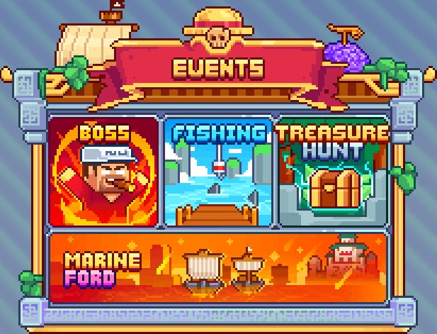

# 📅 Events

To add <mark style="color:yellow;">**more fun**</mark> and excitement to your experience, <mark style="color:yellow;">**several events**</mark> are available on <mark style="color:yellow;">**MinePiece**</mark>.&#x20;

To check the <mark style="color:yellow;">**schedule**</mark> for each event and their <mark style="color:yellow;">**availability**</mark>, simply enter the command <mark style="color:yellow;">**`/events`**</mark>.

<figure><figcaption>
<strong>Menu </strong><mark style="color:yellow;"><strong><code>/events</code></strong></mark>
</figcaption></figure>

As you can see, there are <mark style="color:yellow;">**2 daily events available**</mark>, and <mark style="color:yellow;">**2 more**</mark> are <mark style="color:yellow;">**scheduled**</mark> to <mark style="color:yellow;">**arrive soon**</mark>.&#x20;

Here is some <mark style="color:yellow;">**information**</mark> about each of them.

## <mark style="color:orange;">**Boss Event**</mark>

Every day at 2 PM, 6 PM, and 9 PM, <mark style="color:yellow;">**challenge powerful bosses**</mark> on the <mark style="color:orange;">**adventure islands**</mark>.&#x20;

Your goal is to <mark style="color:yellow;">**inflict maximum damage**</mark> to win fantastic <mark style="color:yellow;">**rewards**</mark>.

Be cautious, as these bosses are <mark style="color:yellow;">**remarkably powerful**</mark>.

## <mark style="color:orange;">**Treasure Hunt Event**</mark>

Every day at 10 AM, 12 PM, 2 PM, 4 PM, 6 PM, 8 PM, 10 PM, and 12 AM, participate in the <mark style="color:yellow;">**Treasure Hunt Event**</mark>.

<mark style="color:yellow;">**Explore the deserted islands**</mark> around <mark style="color:yellow;">**Foosha**</mark> in search of <mark style="color:yellow;">**mysterious treasure chest**</mark>. Be the first to <mark style="color:yellow;">**spot the chest**</mark> and have the chance to win <mark style="color:yellow;">**exclusive and exceptional rewards**</mark>.


The section on <mark style="color:yellow;">**Events**</mark> has come to an end. Have a great time on <mark style="color:yellow;">**MinePiece**</mark>! 🎮

