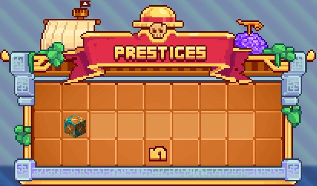

# ⚙️ Island Prestiges


**Crews & Islands**


As you have seen in the previous section on 🏝 <mark style="color:orange;">**Crews**</mark>, <mark style="color:yellow;">**improvements are available**</mark> for them. These are the <mark style="color:yellow;">**island prestiges**</mark>.&#x20;

There are a total of <mark style="color:yellow;">**7 prestiges**</mark>, purchasable in <mark style="color:yellow;">**two ways**</mark>, with <mark style="color:yellow;">**in-game money**</mark> in the <mark style="color:yellow;">**`/prestige`**</mark> menu or with <mark style="color:green;">**Gems**</mark> in the <mark style="color:yellow;">**`/vip`**</mark> menu.

<figure><figcaption>
Menu <mark style="color:yellow;"><strong><code>/prestige</code></strong></mark>
</figcaption></figure>

In this section, we will detail the <mark style="color:yellow;">**characteristics**</mark> of each of the <mark style="color:yellow;">**7 island prestiges**</mark>.

## <mark style="color:orange;">**Characteristics**</mark>

Here are some explanations about the <mark style="color:yellow;">**characteristics**</mark> that will evolve during <mark style="color:yellow;">**island prestige upgrades**</mark>.

* <mark style="color:yellow;">**Generator**</mark>: At the beginning of your adventure, your generator will yield few ores. But by increasing its level, you will progressively unlock new ores and decrease the stone rate.
* <mark style="color:yellow;">**Island Size**</mark>: If you love large farms and beautiful constructions, this characteristic is for you because you will unlock more and more space on your island.
* <mark style="color:yellow;">**Hopper Limit**</mark>: This allows you to place more hoppers on your island to build more factories and farms.
* <mark style="color:yellow;">**Island Chest**</mark>**:** What could be better than secure storage reserved only for members of your island?! That's the advantage of island chests.
* <mark style="color:yellow;">**Member Limit**</mark>: If you play in a team, this is THE perfect characteristic because islands are initially very limited in terms of members. You can play with all your friends by increasing this aspect.
* <mark style="color:yellow;">**Monster Spawn**</mark>: Ideal for hunters, your spawners will be faster.
* <mark style="color:yellow;">**Growth Speed**</mark>: For farmers, your plantations will grow faster.

## <mark style="color:orange;">P</mark><mark style="color:orange;">**restiges**</mark>

Here's some <mark style="color:yellow;">**information**</mark> about each of the <mark style="color:yellow;">**7 island prestiges**</mark>.


<mark style="color:yellow;">**Characteristic**</mark> : Improved with Prestige


### <mark style="color:orange;">Prestige 0</mark>

When <mark style="color:yellow;">**creating an island**</mark>, it starts at <mark style="color:yellow;">**level 0**</mark>. You will need to <mark style="color:yellow;">**upgrade**</mark> it to <mark style="color:yellow;">**unlock benefits**</mark> and <mark style="color:yellow;">**abilities**</mark> that will be very useful throughout your adventure.

| Characteristic    | Level / Percentage / Quantity |
| ----------------- | ----------------------------- |
| **Generator**     | **1**                         |
| **Island Size**   | **50x50**                     |
| **Hopper Limit**  | **32**                        |
| **Island Chest**  | **0**                         |
| **Member Limit**  | **6**                         |
| **Monster Spawn** | **+0%**                       |
| **Growth Speed**  | **+0%**                       |

### <mark style="color:orange;">Prestige 1</mark>

After a few hours of gameplay on the server, you will likely manage to <mark style="color:yellow;">**gather the required amount**</mark> to move on to <mark style="color:yellow;">**the next prestige**</mark>.&#x20;

**Price**: <mark style="color:yellow;">**950,000**</mark>💰 or <mark style="color:green;">**640 Gems**</mark>

| Characteristic                                      | Level / Percentage / Quantity                  |
| --------------------------------------------------- | ---------------------------------------------- |
| <mark style="color:yellow;">**Generator**</mark>    | <mark style="color:yellow;">**2**</mark>       |
| <mark style="color:yellow;">**Island Size**</mark>  | <mark style="color:yellow;">**100x100**</mark> |
| <mark style="color:yellow;">**Hopper Limit**</mark> | <mark style="color:yellow;">**64**</mark>      |
| <mark style="color:yellow;">**Island Chest**</mark> | <mark style="color:yellow;">**1**</mark>       |
| **Member Limit**                                    | **6**                                          |
| **Monster Spawn**                                   | **+0%**                                        |
| **Growth Speed**                                    | **+0%**                                        |

### <mark style="color:orange;">Prestige 2</mark>

**Price** : <mark style="color:yellow;">**2,000,000**</mark>💰 or <mark style="color:green;">**960 Gems**</mark>

| Characteristic                                       | Level / Percentage / Quantity                  |
| ---------------------------------------------------- | ---------------------------------------------- |
| <mark style="color:yellow;">**Generator**</mark>     | <mark style="color:yellow;">**3**</mark>       |
| <mark style="color:yellow;">**Island Size**</mark>   | <mark style="color:yellow;">**150x150**</mark> |
| <mark style="color:yellow;">**Hopper Limit**</mark>  | <mark style="color:yellow;">**92**</mark>      |
| <mark style="color:yellow;">**Island Chest**</mark>  | <mark style="color:yellow;">**2**</mark>       |
| <mark style="color:yellow;">**Member Limit**</mark>  | <mark style="color:yellow;">**7**</mark>       |
| <mark style="color:yellow;">**Monster Spawn**</mark> | <mark style="color:yellow;">**+5%**</mark>     |
| <mark style="color:yellow;">**Growth Speed**</mark>  | <mark style="color:yellow;">**+5%**</mark>     |

### <mark style="color:orange;">Prestige 3</mark>

**Price** : <mark style="color:yellow;">**6,500,000**</mark>💰 or <mark style="color:green;">**1,280 Gems**</mark>

<table><thead><tr><th width="340">Characteristic</th><th>Level / Percentage / Quantity</th></tr></thead><tbody><tr><td><mark style="color:yellow;"><strong>Generator</strong></mark></td><td><mark style="color:yellow;"><strong>4</strong></mark></td></tr><tr><td><mark style="color:yellow;"><strong>Island Size</strong></mark></td><td><mark style="color:yellow;"><strong>200x200</strong></mark></td></tr><tr><td><mark style="color:yellow;"><strong>Hopper Limit</strong></mark></td><td><mark style="color:yellow;"><strong>128</strong></mark></td></tr><tr><td><mark style="color:yellow;"><strong>Island Chest</strong></mark></td><td><mark style="color:yellow;"><strong>3</strong></mark></td></tr><tr><td><strong>Member Limit</strong></td><td><strong>7</strong></td></tr><tr><td><mark style="color:yellow;"><strong>Monster Spawn</strong></mark></td><td><mark style="color:yellow;"><strong>+10%</strong></mark></td></tr><tr><td><mark style="color:yellow;"><strong>Growth Speed</strong></mark></td><td><mark style="color:yellow;"><strong>+10%</strong></mark></td></tr></tbody></table>

### <mark style="color:orange;">Prestige 4</mark>

**Price** : <mark style="color:yellow;">**11,000,000**</mark>💰 or <mark style="color:green;">**1,600 Gems**</mark>

<table><thead><tr><th width="340">Characteristic</th><th>Level / Percentage / Quantity</th></tr></thead><tbody><tr><td><mark style="color:yellow;"><strong>Generator</strong></mark></td><td><mark style="color:yellow;"><strong>5</strong></mark></td></tr><tr><td><mark style="color:yellow;"><strong>Island Size</strong></mark></td><td><mark style="color:yellow;"><strong>250x250</strong></mark></td></tr><tr><td><mark style="color:yellow;"><strong>Hopper Limit</strong></mark></td><td><mark style="color:yellow;"><strong>160</strong></mark></td></tr><tr><td><mark style="color:yellow;"><strong>Island Chest</strong></mark></td><td><mark style="color:yellow;"><strong>4</strong></mark></td></tr><tr><td><mark style="color:yellow;"><strong>Member Limit</strong></mark></td><td><mark style="color:yellow;"><strong>8</strong></mark></td></tr><tr><td><mark style="color:yellow;"><strong>Monster Spawn</strong></mark></td><td><mark style="color:yellow;"><strong>+15%</strong></mark></td></tr><tr><td><mark style="color:yellow;"><strong>Growth Speed</strong></mark></td><td><mark style="color:yellow;"><strong>+15%</strong></mark></td></tr></tbody></table>

### <mark style="color:orange;">Prestige 5</mark>

**Price** : <mark style="color:yellow;">**16,000,000**</mark>💰 or <mark style="color:green;">**1,920 Gems**</mark>

<table><thead><tr><th width="340">Characteristic</th><th>Level / Percentage / Quantity</th></tr></thead><tbody><tr><td><mark style="color:yellow;"><strong>Generator</strong></mark></td><td><mark style="color:yellow;"><strong>6</strong></mark></td></tr><tr><td><mark style="color:yellow;"><strong>Island Size</strong></mark></td><td><mark style="color:yellow;"><strong>300x300</strong></mark></td></tr><tr><td><mark style="color:yellow;"><strong>Hopper Limit</strong></mark></td><td><mark style="color:yellow;"><strong>192</strong></mark></td></tr><tr><td><mark style="color:yellow;"><strong>Island Chest</strong></mark></td><td><mark style="color:yellow;"><strong>5</strong></mark></td></tr><tr><td><strong>Member Limit</strong></td><td><strong>8</strong></td></tr><tr><td><mark style="color:yellow;"><strong>Monster Spawn</strong></mark></td><td><mark style="color:yellow;"><strong>+20%</strong></mark></td></tr><tr><td><mark style="color:yellow;"><strong>Growth Speed</strong></mark></td><td><mark style="color:yellow;"><strong>+20%</strong></mark></td></tr></tbody></table>

### <mark style="color:orange;">Prestige 6</mark>

**Price** : <mark style="color:yellow;">**32,500,000**</mark>💰 or <mark style="color:green;">**2,560 Gems**</mark>

<table><thead><tr><th width="340">Characteristic</th><th>Level / Percentage / Quantity</th></tr></thead><tbody><tr><td><mark style="color:yellow;"><strong>Generator</strong></mark></td><td><mark style="color:yellow;"><strong>7</strong></mark></td></tr><tr><td><mark style="color:yellow;"><strong>Island Size</strong></mark></td><td><mark style="color:yellow;"><strong>350x350</strong></mark></td></tr><tr><td><mark style="color:yellow;"><strong>Hopper Limit</strong></mark></td><td><mark style="color:yellow;"><strong>224</strong></mark></td></tr><tr><td><mark style="color:yellow;"><strong>Island Chest</strong></mark></td><td><mark style="color:yellow;"><strong>8</strong></mark></td></tr><tr><td><mark style="color:yellow;"><strong>Member Limit</strong></mark></td><td><mark style="color:yellow;"><strong>10</strong></mark></td></tr><tr><td><mark style="color:yellow;"><strong>Monster Spawn</strong></mark></td><td><mark style="color:yellow;"><strong>+25%</strong></mark></td></tr><tr><td><mark style="color:yellow;"><strong>Growth Speed</strong></mark></td><td><mark style="color:yellow;"><strong>+25%</strong></mark></td></tr></tbody></table>

### <mark style="color:orange;">Prestige 7</mark>

**Price** : <mark style="color:yellow;">**130,000,000**</mark>💰 or <mark style="color:green;">**3,840 Gems**</mark>

<table><thead><tr><th width="340">Characteristic</th><th>Level / Percentage / Quantity</th></tr></thead><tbody><tr><td><mark style="color:yellow;"><strong>Generator</strong></mark></td><td><mark style="color:yellow;"><strong>8</strong></mark></td></tr><tr><td><mark style="color:yellow;"><strong>Island Size</strong></mark></td><td><mark style="color:yellow;"><strong>400x400</strong></mark></td></tr><tr><td><mark style="color:yellow;"><strong>Hopper Limit</strong></mark></td><td><mark style="color:yellow;"><strong>312</strong></mark></td></tr><tr><td><mark style="color:yellow;"><strong>Island Chest</strong></mark></td><td><mark style="color:yellow;"><strong>9</strong></mark></td></tr><tr><td><strong>Member Limit</strong></td><td><strong>10</strong></td></tr><tr><td><mark style="color:yellow;"><strong>Monster Spawn</strong></mark></td><td><mark style="color:yellow;"><strong>+30%</strong></mark></td></tr><tr><td><mark style="color:yellow;"><strong>Growth Speed</strong></mark></td><td><mark style="color:yellow;"><strong>+30%</strong></mark></td></tr></tbody></table>


The <mark style="color:orange;">**Island Prestige**</mark> section is now complete.

