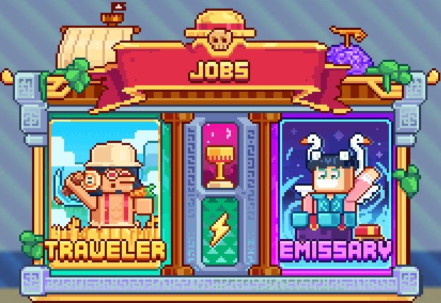

# 👷 Jobs


**Earning Money on MinePiece**


Now that you know everything about 🏝 [<mark style="color:orange;">**Crews**</mark>](crews/), it's time to learn more about ways to <mark style="color:yellow;">**earn rewards**</mark> and improve your <mark style="color:yellow;">**jobs on MinePiece**</mark>.&#x20;

The main method, which we will discuss here, revolves around the <mark style="color:yellow;">**2 available Jobs**</mark>.

<figure><figcaption>
Menu <mark style="color:yellow;"><strong><code>/jobs</code></strong></mark>
</figcaption></figure>

## <mark style="color:orange;">**Traveler Job**</mark>

The <mark style="color:yellow;">**Traveler**</mark> <mark style="color:yellow;">**job**</mark> is assigned <mark style="color:yellow;">**as soon as the player arrives**</mark> on the server. It includes <mark style="color:yellow;">**three major categories**</mark> (<mark style="color:yellow;">**Farmer**</mark>, <mark style="color:yellow;">**Miner**</mark>, <mark style="color:yellow;">**Fisher**</mark>) to form a single and extensive family.

### <mark style="color:orange;">**Progression and Collection**</mark>

* To <mark style="color:yellow;">**progress**</mark>, complete <mark style="color:yellow;">**tasks related to the categories**</mark>, such as collecting and smelting ores, harvesting crops, fishing, cooking fish, breeding, taming livestock, and hunting mobs on different adventure islands (<mark style="color:orange;">**Foosha**</mark> -> <mark style="color:orange;">**Alabasta**</mark>).

### <mark style="color:orange;">**Levels and Rewards**</mark>

* <mark style="color:yellow;">**100 levels**</mark> in <mark style="color:yellow;">**total**</mark>&#x20;
* At <mark style="color:yellow;">**each level**</mark>, benefit from a <mark style="color:yellow;">**stat increase**</mark>.&#x20;
* Every <mark style="color:yellow;">**two levels**</mark>, receive <mark style="color:yellow;">**Berries**</mark>.&#x20;
* Every <mark style="color:yellow;">**five levels**</mark>, a <mark style="color:yellow;">**substantial reward**</mark> awaits.&#x20;


Don't forget the <mark style="color:yellow;">**`/jobs claim`**</mark> to retrieve your <mark style="color:yellow;">**rewards**</mark>!


## <mark style="color:orange;">Jobs boosts</mark>

Understanding the <mark style="color:yellow;">**different types of jobs boosts**</mark> is crucial to maximizing your performance. Here's a detailed explanation:&#x20;

* <mark style="color:yellow;">**Global (Certain Pets and Potions)**</mark>**&#x20;:** Affects all aspects of your trades (XP and money).
* <mark style="color:yellow;">**Jobs (Some Pets and Some Potions)**</mark>**&#x20;:** Targets a specific job to improve the XP and money earned.&#x20;
* <mark style="color:yellow;">**XP (Knowledge Potion)**</mark>**&#x20;:** Increases XP earned for a specific profession.&#x20;
* <mark style="color:yellow;">**Money (Wealth Potion)**</mark>**&#x20;:** Increases the money earned for a specific profession.&#x20;

### <mark style="color:orange;">Important points</mark>

* A boost type is <mark style="color:yellow;">**limited to 50%**</mark>. Thus, a 30% boost and a 20% boost reach the maximum for that type of boost.&#x20;
* You have the freedom to <mark style="color:yellow;">**target a single job**</mark> or <mark style="color:yellow;">**both jobs**</mark> with <mark style="color:yellow;">**XP**</mark> and <mark style="color:yellow;">**money boosts**</mark>, depending on your game strategy. For example, an XP boost on the traveler job and a silver boost on the emissary job is entirely possible.&#x20;
* Two identical boosts <mark style="color:yellow;">**do not add up**</mark> (20% + 20% = 20%).&#x20;
* There is also a global <mark style="color:yellow;">**cap at 100%**</mark>, i.e. a x2 multiplier when adding up the types of boosts. For example, 50% global + 50% emissary + 50% target XP = 100% (not 150%).&#x20;


Understand these mechanisms to maximize your gains and performance on the island. Enjoy your adventure !&#x20;


## <mark style="color:orange;">**Emissary Job**</mark>

To <mark style="color:yellow;">**unlock**</mark> the <mark style="color:yellow;">**Emissary job**</mark>, reach <mark style="color:yellow;">**level 50**</mark> in the <mark style="color:yellow;">**Traveler job**</mark>. Once unlocked, <mark style="color:yellow;">**evolve it to level 100**</mark> to accumulate <mark style="color:yellow;">**new rewards**</mark>. The <mark style="color:yellow;">**Emissary job**</mark> also includes <mark style="color:yellow;">**three major categories**</mark> (<mark style="color:yellow;">**Lumberjack**</mark>, <mark style="color:yellow;">**Forge-Mage**</mark>, <mark style="color:yellow;">**Hunter**</mark>).

### <mark style="color:orange;">**Progression and Collection**</mark>

* To <mark style="color:yellow;">**progress**</mark>, complete <mark style="color:yellow;">**tasks related to the categories**</mark>, such as cutting and smelting logs, enchanting books, repairing items, crafting armor, and hunting animals and monsters, including mobs on different adventure islands (<mark style="color:orange;">**Alabasta**</mark> -> <mark style="color:orange;">**Sabaody**</mark>).

### <mark style="color:orange;">**Levels and Rewards**</mark>

* <mark style="color:yellow;">**100 levels**</mark> in <mark style="color:yellow;">**total**</mark>&#x20;
* At <mark style="color:yellow;">**each level**</mark>, benefit from a <mark style="color:yellow;">**stat increase**</mark>.&#x20;
* Every <mark style="color:yellow;">**two levels**</mark>, receive <mark style="color:yellow;">**Berries**</mark>.&#x20;
* Every <mark style="color:yellow;">**five levels**</mark>, a <mark style="color:yellow;">**substantial reward**</mark> awaits.&#x20;


Don't forget the <mark style="color:yellow;">**`/jobs claim`**</mark> to retrieve your <mark style="color:yellow;">**rewards**</mark>!


## <mark style="color:orange;">Menu</mark>

All <mark style="color:yellow;">**essential information**</mark> about jobs is condensed in the <mark style="color:yellow;">**`/jobs menu`**</mark>.

There you will find:&#x20;

* Your <mark style="color:yellow;">**progression level**</mark>.
* <mark style="color:yellow;">**Paid actions**</mark>.
* <mark style="color:yellow;">**Gains**</mark> associated with each action.
* <mark style="color:yellow;">**Ranking**</mark>.

Explore <mark style="color:yellow;">**`/jobs`**</mark> to <mark style="color:yellow;">**track your progress**</mark> and maximize your <mark style="color:yellow;">**rewards**</mark>! 🌟

## <mark style="color:orange;">**Commands**</mark>


\[...] Means the parameter is mandatory&#x20;

<...> Means you can enter a string with spaces&#x20;

{...} Means the parameter is optional


Here are the commands to know for <mark style="color:yellow;">**managing your jobs**</mark>:&#x20;

* <mark style="color:yellow;">**`/jobs`**</mark> - Command to open the jobs menu.&#x20;
* <mark style="color:yellow;">**`/jobs info [Job]`**</mark> - Command to see information about a job.&#x20;
* <mark style="color:yellow;">**`/jobs stats {Username}`**</mark> - Command to display your job levels or those of another player.


Let's get started, begin now to enrich yourself by advancing in your jobs!

