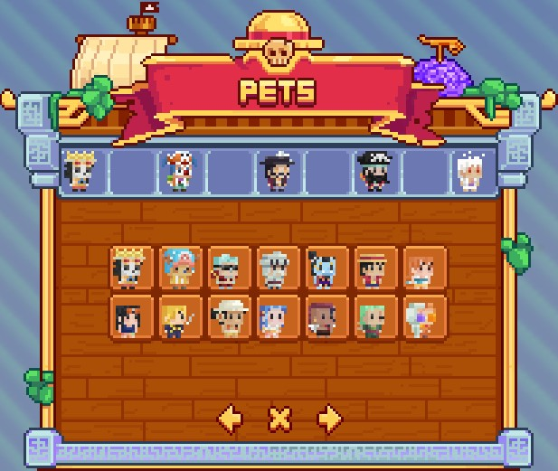
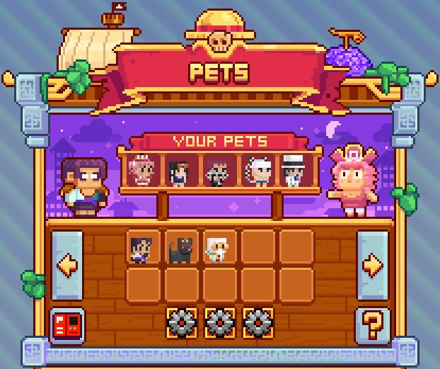

# 🥚 Pets

The <mark style="color:yellow;">**MinePiece**</mark> server offers a <mark style="color:yellow;">**Pets system**</mark> to <mark style="color:yellow;">**accompany**</mark> you during your <mark style="color:yellow;">**adventure**</mark>. With this system, you have the possibility to <mark style="color:yellow;">**acquire several companions**</mark> in the game and <mark style="color:yellow;">**accumulate**</mark> them.&#x20;

<mark style="color:yellow;">**Each pet**</mark> has <mark style="color:yellow;">**specific effects**</mark> to help you in your <mark style="color:yellow;">**progression**</mark>.&#x20;

In total, there are <mark style="color:yellow;">**48 different pets**</mark>, which you can discover using the <mark style="color:yellow;">**`/pokedex`**</mark> command.

These <mark style="color:yellow;">**pets**</mark> are classified according to <mark style="color:yellow;">**different rarities**</mark> in the following order:

* <mark style="color:green;">**Common**</mark> (14)
* <mark style="color:yellow;">**Rare**</mark> (16)
* <mark style="color:blue;">**Epic**</mark> (10)
* <mark style="color:purple;">**Legendary**</mark> (5)
* <mark style="color:red;">**Mythical**</mark> (3)

<figure><figcaption>
<strong>Overview of</strong> <mark style="color:yellow;"><strong><code>/pokedex</code></strong></mark>
</figcaption></figure>

## <mark style="color:green;">**Common Pets**</mark>

<table><thead><tr><th width="189" align="center">Pets</th><th>Effects</th></tr></thead><tbody><tr><td align="center"><mark style="color:green;"><strong>Brook</strong></mark></td><td>
<mark style="color:orange;"><strong>Lvl. 1</strong></mark><strong> -> </strong><mark style="color:orange;"><strong>10%</strong></mark><strong> to double Apples</strong>

<mark style="color:orange;"><strong>Lvl. 5</strong></mark><strong> -> </strong><mark style="color:yellow;"><strong>2,500</strong></mark><a href="https://www.alt-codes.net/dollar-sign.php">💰</a><strong>/h</strong>

<mark style="color:orange;"><strong>Lvl. 10</strong></mark><strong> -> </strong><mark style="color:orange;"><strong>Slow Falling</strong></mark> <mark style="color:orange;"><strong>Lvl. 15</strong></mark><strong> -> </strong><mark style="color:orange;"><strong>+15%</strong></mark><strong> Bones sales</strong>

<mark style="color:orange;"><strong>Lvl. 20</strong></mark><strong> -></strong> <mark style="color:purple;">₪ <strong>Resistance</strong></mark> <mark style="color:purple;"><strong>+2</strong></mark>
</td></tr><tr><td align="center"><mark style="color:green;"><strong>Chopper</strong></mark></td><td>
<mark style="color:orange;"><strong>Lvl. 1</strong></mark><strong> -> </strong><mark style="color:orange;"><strong>10%</strong></mark><strong> to double Carrots</strong>

<mark style="color:orange;"><strong>Lvl. 5</strong></mark><strong> -> </strong><mark style="color:yellow;"><strong>2,500</strong></mark><a href="https://www.alt-codes.net/dollar-sign.php">💰</a><strong>/h</strong>

<mark style="color:orange;"><strong>Lvl. 10</strong></mark><strong> -> </strong><mark style="color:orange;"><strong>+15%</strong></mark><strong> Carrots sales</strong> <mark style="color:orange;"><strong>Lvl. 15</strong></mark><strong> -> </strong><mark style="color:yellow;"><strong>+ 1,500</strong></mark><a href="https://www.alt-codes.net/dollar-sign.php">💰</a><strong>/h</strong>

<mark style="color:orange;"><strong>Lvl. 20</strong></mark><strong> -></strong> <mark style="color:purple;">❣ <strong>Regeneration +2</strong></mark>
</td></tr><tr><td align="center"><mark style="color:green;"><strong>Franky</strong></mark></td><td>
<mark style="color:orange;"><strong>Lvl. 1</strong></mark><strong> -> </strong><mark style="color:orange;"><strong>10%</strong></mark> <strong>to double Raw Iron</strong>

<mark style="color:orange;"><strong>Lvl. 5</strong></mark><strong> -> </strong><mark style="color:orange;"><strong>-20%</strong></mark><strong> Explosion</strong> <strong>damage</strong>

<mark style="color:orange;"><strong>Lvl. 10</strong></mark><strong> -> </strong><mark style="color:orange;"><strong>+10%</strong></mark><strong> drop on Water Seven island</strong> <mark style="color:orange;"><strong>Lvl. 15</strong></mark><strong> -> </strong><mark style="color:yellow;"><strong>4,000</strong></mark><a href="https://www.alt-codes.net/dollar-sign.php">💰</a><strong>/h</strong>

<mark style="color:orange;"><strong>Lvl. 20</strong></mark><strong> -></strong> <mark style="color:purple;">₪ <strong>Resistance</strong></mark> <mark style="color:purple;"><strong>+2</strong></mark>
</td></tr><tr><td align="center"><mark style="color:green;"><strong>Gan Forr</strong></mark></td><td>
<mark style="color:orange;"><strong>Lvl. 1</strong></mark><strong> -> </strong><mark style="color:orange;"><strong>+15%</strong></mark><strong> Cobblestone sale</strong>

<mark style="color:orange;"><strong>Lvl. 5</strong></mark><strong> -> </strong><mark style="color:yellow;"><strong>2,500</strong></mark><a href="https://www.alt-codes.net/dollar-sign.php">💰</a><strong>/h</strong>

<mark style="color:orange;"><strong>Lvl. 10</strong></mark><strong> -> </strong><mark style="color:orange;"><strong>+5%</strong></mark><strong> Emissary job gain</strong> <mark style="color:orange;"><strong>Lvl. 15</strong></mark><strong> -> </strong><mark style="color:orange;"><strong>Speed I</strong></mark>

<mark style="color:orange;"><strong>Lvl. 20</strong></mark><strong> -> </strong><mark style="color:orange;"><strong>+10%</strong></mark><strong> damage on Skypiea island</strong>
</td></tr><tr><td align="center"><mark style="color:green;"><strong>Jinbei</strong></mark></td><td>
<mark style="color:orange;"><strong>Lvl. 1</strong></mark><strong> -> </strong><mark style="color:yellow;"><strong>2,500</strong></mark><a href="https://www.alt-codes.net/dollar-sign.php">💰</a><strong>/h</strong>

<mark style="color:orange;"><strong>Lvl. 5</strong></mark><strong> -> </strong><mark style="color:orange;"><strong>+15%</strong></mark><strong> Kelp sale</strong>

<mark style="color:orange;"><strong>Lvl. 10</strong></mark><strong> -> </strong><mark style="color:orange;"><strong>Respiration II</strong></mark> <mark style="color:orange;"><strong>Lvl. 15</strong></mark><strong> -> </strong><mark style="color:yellow;"><strong>4,000</strong></mark><a href="https://www.alt-codes.net/dollar-sign.php">💰</a><strong>/h</strong>

<mark style="color:orange;"><strong>Lvl. 20</strong></mark><strong> -> </strong><mark style="color:orange;"><strong>Ocean's Strength</strong></mark>
</td></tr><tr><td align="center"><mark style="color:green;"><strong>Luffy</strong></mark></td><td>
<mark style="color:orange;"><strong>Lvl. 1</strong></mark><strong> -> </strong><mark style="color:orange;"><strong>+10%</strong></mark><strong> Experience gain</strong>

<mark style="color:orange;"><strong>Lvl. 5</strong></mark><strong> -> </strong><mark style="color:orange;"><strong>+10%</strong></mark><strong> drop on Foosha island</strong>

<mark style="color:orange;"><strong>Lvl. 10</strong></mark><strong> -> </strong><mark style="color:orange;"><strong>+5%</strong></mark><strong> Traveler Job gain</strong> <mark style="color:orange;"><strong>Lvl. 15</strong></mark><strong> -> </strong><mark style="color:orange;"><strong>-100%</strong></mark><strong> Lightning damage</strong> <mark style="color:orange;"><strong>Lvl. 20</strong></mark><strong> -> </strong><mark style="color:yellow;"><strong>6,000</strong></mark><a href="https://www.alt-codes.net/dollar-sign.php">💰</a><strong>/h</strong>
</td></tr><tr><td align="center"><mark style="color:green;"><strong>Nami</strong></mark></td><td>
<mark style="color:orange;"><strong>Lvl. 1</strong></mark><strong> -> </strong><mark style="color:yellow;"><strong>2,000</strong></mark><a href="https://www.alt-codes.net/dollar-sign.php">💰</a><strong>/h</strong>

<mark style="color:orange;"><strong>Lvl. 5</strong></mark><strong> -></strong><mark style="color:yellow;"><strong>+ 1,000</strong></mark><a href="https://www.alt-codes.net/dollar-sign.php">💰</a><strong>/h</strong>

<mark style="color:orange;"><strong>Lvl. 10</strong></mark><strong> -></strong><mark style="color:yellow;"><strong>+ 1,000</strong></mark><a href="https://www.alt-codes.net/dollar-sign.php">💰</a><strong>/h</strong> <mark style="color:orange;"><strong>Lvl. 15</strong></mark><strong> -></strong><mark style="color:yellow;"><strong>+ 1,000</strong></mark><a href="https://www.alt-codes.net/dollar-sign.php">💰</a><strong>/h</strong> <mark style="color:orange;"><strong>Lvl. 20</strong></mark><strong> -></strong><mark style="color:yellow;"><strong>+ 1,000</strong></mark><a href="https://www.alt-codes.net/dollar-sign.php">💰</a><strong>/h</strong>
</td></tr><tr><td align="center"><mark style="color:green;"><strong>Nico Robin</strong></mark></td><td>
<mark style="color:orange;"><strong>Lvl. 1</strong></mark><strong> -> </strong><mark style="color:orange;"><strong>+10%</strong></mark><strong> drop on Alabasta island</strong>

<mark style="color:orange;"><strong>Lvl. 5</strong></mark><strong> -> </strong><mark style="color:yellow;"><strong>2,500</strong></mark><a href="https://www.alt-codes.net/dollar-sign.php">💰</a><strong>/h</strong>

<mark style="color:orange;"><strong>Lvl. 10</strong></mark><strong> -> </strong><mark style="color:orange;"><strong>+15%</strong></mark><strong> Experience gain</strong> <mark style="color:orange;"><strong>Lvl. 15</strong></mark><strong> -> </strong><mark style="color:orange;"><strong>+10%</strong></mark><strong> Bounty gain</strong> <mark style="color:orange;"><strong>Lvl. 20</strong></mark><strong> -> </strong><mark style="color:orange;"><strong>Haste 1</strong></mark>
</td></tr><tr><td align="center"><mark style="color:green;"><strong>Sanji</strong></mark></td><td>
<mark style="color:orange;"><strong>Lvl. 1</strong></mark><strong> -> </strong><mark style="color:orange;"><strong>+10%</strong></mark><strong> double Vanilla Fish</strong>

<mark style="color:orange;"><strong>Lvl. 5</strong></mark><strong> -> </strong><mark style="color:yellow;"><strong>2,500</strong></mark><a href="https://www.alt-codes.net/dollar-sign.php">💰</a><strong>/h</strong>

<mark style="color:orange;"><strong>Lvl. 10</strong></mark><strong> -> </strong><mark style="color:orange;"><strong>+15%</strong></mark><strong> Fish price</strong> <mark style="color:orange;"><strong>Lvl. 15</strong></mark><strong> -> </strong><mark style="color:orange;"><strong>Speed I</strong></mark> <mark style="color:orange;"><strong>Lvl. 20</strong></mark><strong> -></strong> 🗡 <mark style="color:red;"><strong>Strength +2</strong></mark>
</td></tr><tr><td align="center"><mark style="color:green;"><strong>Usopp</strong></mark></td><td>
<mark style="color:orange;"><strong>Lvl. 1</strong></mark><strong> -> </strong><mark style="color:orange;"><strong>+15%</strong></mark><strong> Crop sale</strong>

<mark style="color:orange;"><strong>Lvl. 5</strong></mark><strong> -> </strong><mark style="color:yellow;"><strong>2,500</strong></mark><a href="https://www.alt-codes.net/dollar-sign.php">💰</a><strong>/h</strong>

<mark style="color:orange;"><strong>Lvl. 10</strong></mark><strong> -> </strong><mark style="color:orange;"><strong>+5%</strong></mark><strong> Traveler Job gain</strong> <mark style="color:orange;"><strong>Lvl. 15</strong></mark><strong> -> </strong><mark style="color:yellow;"><strong>+ 1,500</strong></mark><a href="https://www.alt-codes.net/dollar-sign.php">💰</a><strong>/h</strong> <mark style="color:orange;"><strong>Lvl. 20</strong></mark><strong> -> </strong><mark style="color:orange;"><strong>Speed I</strong></mark>
</td></tr><tr><td align="center"><mark style="color:green;"><strong>Vivi</strong></mark></td><td>
<mark style="color:orange;"><strong>Lvl. 1</strong></mark><strong> -> </strong><mark style="color:orange;"><strong>+15%</strong></mark><strong> Crop sale</strong>

<mark style="color:orange;"><strong>Lvl. 5</strong></mark><strong> -> </strong><mark style="color:yellow;"><strong>2,500</strong></mark><a href="https://www.alt-codes.net/dollar-sign.php">💰</a><strong>/h</strong>

<mark style="color:orange;"><strong>Lvl. 10</strong></mark><strong> -> </strong><mark style="color:orange;"><strong>10%</strong></mark><strong> to inflict Poison on enemies</strong> <mark style="color:orange;"><strong>Lvl. 15</strong></mark><strong> -> </strong><mark style="color:yellow;"><strong>+ 1,500</strong></mark><a href="https://www.alt-codes.net/dollar-sign.php">💰</a><strong>/h</strong> <mark style="color:orange;"><strong>Lvl. 20</strong></mark><strong> -> </strong><mark style="color:orange;"><strong>Haste II</strong></mark>
</td></tr><tr><td align="center"><mark style="color:green;"><strong>Wiper</strong></mark></td><td>
<mark style="color:orange;"><strong>Lvl. 1</strong></mark><strong> -> </strong><mark style="color:orange;"><strong>+15%</strong></mark><strong> Coal sale</strong>

<mark style="color:orange;"><strong>Lvl. 5</strong></mark><strong> -> </strong><mark style="color:yellow;"><strong>2,500</strong></mark><a href="https://www.alt-codes.net/dollar-sign.php">💰</a><strong>/h</strong>

<mark style="color:orange;"><strong>Lvl. 10</strong></mark><strong> -> </strong><mark style="color:orange;"><strong>+5%</strong></mark><strong> Traveler Job gain</strong> <mark style="color:orange;"><strong>Lvl. 15</strong></mark><strong> -> </strong><mark style="color:orange;"><strong>Speed II</strong></mark> <mark style="color:orange;"><strong>Lvl. 20</strong></mark><strong> -> </strong><mark style="color:orange;"><strong>+5%</strong></mark><strong> damage on Skypiea</strong>
</td></tr><tr><td align="center"><mark style="color:green;"><strong>Zoro</strong></mark></td><td>
<mark style="color:orange;"><strong>Lvl. 1</strong></mark><strong> -> </strong><mark style="color:orange;"><strong>+15%</strong></mark><strong> Bamboo sale</strong>

<mark style="color:orange;"><strong>Lvl. 5</strong></mark><strong> -> </strong><mark style="color:yellow;"><strong>2,500</strong></mark><a href="https://www.alt-codes.net/dollar-sign.php">💰</a><strong>/h</strong>

<mark style="color:orange;"><strong>Lvl. 10</strong></mark><strong> -> </strong><mark style="color:orange;"><strong>+5%</strong></mark><strong> Traveler Job gain</strong> <mark style="color:orange;"><strong>Lvl. 15</strong></mark><strong> -></strong> 🗡 <mark style="color:red;"><strong>Strength +2</strong></mark> <mark style="color:orange;"><strong>Lvl. 20</strong></mark><strong> -> </strong><mark style="color:orange;"><strong>+10%</strong></mark><strong> damage on Orange Town</strong>
</td></tr><tr><td align="center"><mark style="color:green;"><strong>Nightmare Luffy</strong></mark></td><td>
<mark style="color:orange;"><strong>Lvl. 1</strong></mark><strong> -> </strong><mark style="color:orange;"><strong>+15%</strong></mark><strong> Crop sale</strong>

<mark style="color:orange;"><strong>Lvl. 5</strong></mark><strong> -> </strong><mark style="color:orange;"><strong>+5%</strong></mark><strong> Emissary Job gain</strong>

<mark style="color:orange;"><strong>Lvl. 10</strong></mark><strong> -> </strong><mark style="color:orange;"><strong>+10%</strong></mark><strong> damage on Thriller Bark Island</strong> <mark style="color:orange;"><strong>Lvl. 15</strong></mark><strong> -> </strong><mark style="color:yellow;"><strong>5,000</strong></mark><a href="https://www.alt-codes.net/dollar-sign.php">💰</a><strong>/h</strong> <mark style="color:orange;"><strong>Lvl. 20</strong></mark><strong> -></strong> <mark style="color:purple;">❣ <strong>Regeneration +2</strong></mark>
</td></tr></tbody></table>

## <mark style="color:yellow;">**Rare Pets**</mark>

<table><thead><tr><th width="189" align="center">Pets</th><th>Effects</th></tr></thead><tbody><tr><td align="center"><mark style="color:yellow;"><strong>Arlong</strong></mark></td><td>
<mark style="color:orange;"><strong>Lvl. 1</strong></mark><strong> -> </strong><mark style="color:orange;"><strong>+20%</strong></mark><strong> drop on Orange Town Island</strong>

<mark style="color:orange;"><strong>Lvl. 5</strong></mark><strong> -></strong> 🗡 <mark style="color:red;"><strong>Strength</strong></mark> <strong>+2</strong>

<mark style="color:orange;"><strong>Lvl. 10</strong></mark><strong> -> </strong><mark style="color:yellow;"><strong>7,500</strong></mark><a href="https://www.alt-codes.net/dollar-sign.php">💰</a><strong>/h</strong> <mark style="color:orange;"><strong>Lvl. 15</strong></mark><strong> -> </strong><mark style="color:orange;"><strong>Ocean's Strength</strong></mark>

<mark style="color:orange;"><strong>Lvl. 20</strong></mark><strong> -> </strong><mark style="color:orange;"><strong>Speed I</strong></mark>
</td></tr><tr><td align="center"><mark style="color:yellow;"><strong>Buggy</strong></mark></td><td>
<mark style="color:orange;"><strong>Lvl. 1</strong></mark><strong> -> </strong><mark style="color:yellow;"><strong>5,000</strong></mark><a href="https://www.alt-codes.net/dollar-sign.php">💰</a><strong>/h</strong>

<mark style="color:orange;"><strong>Lvl. 5</strong></mark><strong> -> </strong><mark style="color:orange;"><strong>+10%</strong></mark><strong> Traveler Job gain</strong>

<mark style="color:orange;"><strong>Lvl. 10</strong></mark><strong> -> </strong><mark style="color:orange;"><strong>+15%</strong></mark><strong> drop on Orange Town Island</strong> <mark style="color:orange;"><strong>Lvl. 15</strong></mark><strong> -> </strong><mark style="color:yellow;"><strong>+ 2,500</strong></mark><a href="https://www.alt-codes.net/dollar-sign.php">💰</a><strong>/h</strong>

<mark style="color:orange;"><strong>Lvl. 20</strong></mark><strong> -></strong> <mark style="color:purple;">₪ <strong>Resistance</strong></mark> <mark style="color:purple;"><strong>+2</strong></mark>
</td></tr><tr><td align="center"><mark style="color:yellow;"><strong>Bellamy</strong></mark></td><td>
<mark style="color:orange;"><strong>Lvl. 1</strong></mark><strong> -> </strong><mark style="color:yellow;"><strong>5,000</strong></mark><a href="https://www.alt-codes.net/dollar-sign.php">💰</a><strong>/h</strong>

<mark style="color:orange;"><strong>Lvl. 5</strong></mark><strong> -> </strong><mark style="color:orange;"><strong>-25%</strong></mark><strong> Fall damage</strong>

<mark style="color:orange;"><strong>Lvl. 10</strong></mark><strong> -> </strong><mark style="color:orange;"><strong>+10%</strong></mark><strong> Emissary Job gain</strong>

<mark style="color:orange;"><strong>Lvl. 15</strong></mark><strong> -> </strong><mark style="color:yellow;"><strong>+ 2,500</strong></mark><a href="https://www.alt-codes.net/dollar-sign.php">💰</a><strong>/h</strong>

<mark style="color:orange;"><strong>Lvl. 20</strong></mark><strong> --> </strong><mark style="color:orange;"><strong>+30%</strong></mark><strong> damage Spring Fruit</strong>
</td></tr><tr><td align="center"><mark style="color:yellow;"><strong>Bepo</strong></mark></td><td>
<mark style="color:orange;"><strong>Lvl. 1</strong></mark><strong> -> </strong><mark style="color:yellow;"><strong>5,000</strong></mark><a href="https://www.alt-codes.net/dollar-sign.php">💰</a><strong>/h</strong>

<mark style="color:orange;"><strong>Lvl. 5</strong></mark><strong> -> </strong><mark style="color:orange;"><strong>-100%</strong></mark><strong> Frost damage</strong>

<mark style="color:orange;"><strong>Lvl. 10</strong></mark><strong> -> </strong><mark style="color:orange;"><strong>+10%</strong></mark><strong> Emissary Job gain</strong> <mark style="color:orange;"><strong>Lvl. 15</strong></mark><strong> -> </strong><mark style="color:yellow;"><strong>+ 2,500</strong></mark><a href="https://www.alt-codes.net/dollar-sign.php">💰</a><strong>/h</strong>

<mark style="color:orange;"><strong>Lvl. 20</strong></mark><strong> -> </strong><mark style="color:orange;"><strong>+10%</strong></mark><strong> to strike lightning on the Enemy</strong>
</td></tr><tr><td align="center"><mark style="color:yellow;"><strong>Don Krieg</strong></mark></td><td>
<mark style="color:orange;"><strong>Lvl. 1</strong></mark><strong> -> </strong><mark style="color:orange;"><strong>+15%</strong></mark><strong> drop on Baratie Island</strong>

<mark style="color:orange;"><strong>Lvl. 5</strong></mark><strong> -></strong> <mark style="color:purple;">₪ <strong>Resistance +2</strong></mark>

<mark style="color:orange;"><strong>Lvl. 10</strong></mark><strong> -> </strong><mark style="color:orange;"><strong>-40%</strong></mark><strong> Explosion damage</strong> <mark style="color:orange;"><strong>Lvl. 15</strong></mark><strong> -> </strong><mark style="color:orange;"><strong>Ocean's Strength</strong></mark>

<mark style="color:orange;"><strong>Lvl. 20</strong></mark><strong> -></strong> 🗡 <mark style="color:red;"><strong>Force +2</strong></mark>
</td></tr><tr><td align="center"><mark style="color:yellow;"><strong>Ener</strong></mark></td><td>
<mark style="color:orange;"><strong>Lvl. 1</strong></mark><strong> -> </strong><mark style="color:orange;"><strong>-100%</strong></mark><strong> Lightning damage</strong>

<mark style="color:orange;"><strong>Lvl. 5</strong></mark><strong> -> </strong><mark style="color:orange;"><strong>+15%</strong></mark><strong> damage on Skypiea Island</strong>

<mark style="color:orange;"><strong>Lvl. 10</strong></mark><strong> -> </strong><mark style="color:orange;"><strong>+20%</strong></mark><strong> drop on Skypiea Island</strong> <mark style="color:orange;"><strong>Lvl. 15</strong></mark><strong> -> </strong><mark style="color:yellow;"><strong>10,000</strong></mark><a href="https://www.alt-codes.net/dollar-sign.php">💰</a><strong>/h</strong> <mark style="color:orange;"><strong>Lvl. 20</strong></mark><strong> -> </strong><mark style="color:orange;"><strong>Speed II</strong></mark>
</td></tr><tr><td align="center"><mark style="color:yellow;"><strong>Hattori</strong></mark></td><td>
<mark style="color:orange;"><strong>Lvl. 1</strong></mark><strong> -> </strong><mark style="color:orange;"><strong>+25%</strong></mark><strong> Feather sales</strong> 

<mark style="color:orange;"><strong>Lvl. 5</strong></mark><strong> -></strong><mark style="color:orange;"><strong>+50%</strong></mark><strong> Feather sales</strong>

<mark style="color:orange;"><strong>Lvl. 10</strong></mark><strong> -></strong><mark style="color:orange;"><strong>Mount</strong></mark><strong> (fly)</strong> <mark style="color:orange;"><strong>Lvl. 15</strong></mark><strong> -></strong><mark style="color:yellow;"><strong>10,000</strong></mark><a href="https://www.alt-codes.net/dollar-sign.php">💰</a><strong>/h</strong> <mark style="color:orange;"><strong>Lvl. 20</strong></mark><strong> -></strong><mark style="color:orange;"><strong>+100%</strong></mark><strong> Feather sales</strong>
</td></tr><tr><td align="center"><mark style="color:yellow;"><strong>Higuma</strong></mark></td><td>
<mark style="color:orange;"><strong>Lvl. 1</strong></mark><strong> -> </strong><mark style="color:orange;"><strong>+15%</strong></mark><strong> drop on Foosha Island</strong>

<mark style="color:orange;"><strong>Lvl. 5</strong></mark><strong> -> </strong><mark style="color:orange;"><strong>Speed I</strong></mark>

<mark style="color:orange;"><strong>Lvl. 10</strong></mark><strong> -> </strong><mark style="color:orange;"><strong>-40%</strong></mark><strong> explosion damage</strong> <mark style="color:orange;"><strong>Lvl. 15</strong></mark><strong> -> </strong><mark style="color:orange;"><strong>+20%</strong></mark><strong> Wheat sales</strong> <mark style="color:orange;"><strong>Lvl. 20</strong></mark><strong> -> </strong><mark style="color:yellow;"><strong>6,000</strong></mark><a href="https://www.alt-codes.net/dollar-sign.php">💰</a><strong>/h</strong>
</td></tr><tr><td align="center"><mark style="color:yellow;"><strong>Katakuri</strong></mark></td><td>
<mark style="color:orange;"><strong>Lvl. 1</strong></mark><strong> -> </strong><mark style="color:yellow;"><strong>5,000</strong></mark><a href="https://www.alt-codes.net/dollar-sign.php">💰</a><strong>/h</strong>

<mark style="color:orange;"><strong>Lvl. 5</strong></mark><strong> -> </strong><mark style="color:orange;"><strong>+15%</strong></mark><strong> damage on Sabaody Island</strong>

<mark style="color:orange;"><strong>Lvl. 10</strong></mark><strong> -></strong> <mark style="color:purple;">₪ <strong>Resistance +2</strong></mark> <mark style="color:orange;"><strong>Lvl. 15</strong></mark><strong> -> </strong><mark style="color:yellow;"><strong>+ 2,500</strong></mark><a href="https://www.alt-codes.net/dollar-sign.php">💰</a><strong>/h</strong> <mark style="color:orange;"><strong>Lvl. 20</strong></mark><strong> -> </strong><mark style="color:orange;"><strong>Speed II</strong></mark>
</td></tr><tr><td align="center"><mark style="color:yellow;"><strong>Mister One</strong></mark></td><td>
<mark style="color:orange;"><strong>Lvl. 1</strong></mark><strong> -> </strong><mark style="color:orange;"><strong>+20%</strong></mark><strong> Cactus sales</strong>

<mark style="color:orange;"><strong>Lvl. 5</strong></mark><strong> -> </strong><mark style="color:orange;"><strong>+15%</strong></mark><strong> drop on Alabasta Island</strong>

<mark style="color:orange;"><strong>Lvl. 10</strong></mark><strong> -></strong> <mark style="color:purple;">₪ <strong>Resistance</strong></mark> <mark style="color:purple;"><strong>+2</strong></mark> <mark style="color:orange;"><strong>Lvl. 15</strong></mark><strong> -> </strong><mark style="color:yellow;"><strong>7,500</strong></mark><a href="https://www.alt-codes.net/dollar-sign.php">💰</a><strong>/h</strong> <mark style="color:orange;"><strong>Lvl. 20</strong></mark><strong> -> </strong><mark style="color:orange;"><strong>Speed I</strong></mark>
</td></tr><tr><td align="center"><mark style="color:yellow;"><strong>Perona</strong></mark></td><td>
<mark style="color:orange;"><strong>Lvl. 1</strong></mark><strong> -> </strong><mark style="color:yellow;"><strong>5,000</strong></mark><a href="https://www.alt-codes.net/dollar-sign.php">💰</a><strong>/h</strong>

<mark style="color:orange;"><strong>Lvl. 5</strong></mark><strong> -> </strong><mark style="color:orange;"><strong>+15%</strong></mark><strong> double Bones and Arrows</strong>

<mark style="color:orange;"><strong>Lvl. 10</strong></mark><strong> -> </strong><mark style="color:orange;"><strong>+15%</strong></mark><strong> drop on Thriller Bark Island</strong> <mark style="color:orange;"><strong>Lvl. 15</strong></mark><strong> -> </strong><mark style="color:yellow;"><strong>+ 2,500</strong></mark><a href="https://www.alt-codes.net/dollar-sign.php">💰</a><strong>/h</strong> <mark style="color:orange;"><strong>Lvl. 20</strong></mark><strong> -> </strong><mark style="color:orange;"><strong>15%</strong></mark><strong> double Strings and Eyes</strong>
</td></tr><tr><td align="center"><mark style="color:yellow;"><strong>Rob Lucci</strong></mark></td><td>
<mark style="color:orange;"><strong>Lvl. 1</strong></mark><strong> -> </strong><mark style="color:orange;"><strong>+15%</strong></mark><strong> drop on Water Seven Island</strong>

<mark style="color:orange;"><strong>Lvl. 5</strong></mark><strong> -> </strong><mark style="color:orange;"><strong>Speed I</strong></mark>

<mark style="color:orange;"><strong>Lvl. 10</strong></mark><strong> -> </strong><mark style="color:orange;"><strong>-40%</strong></mark><strong> explosion damage</strong> <mark style="color:orange;"><strong>Lvl. 15</strong></mark><strong> -> </strong><mark style="color:orange;"><strong>Ocean's Strength</strong></mark> <mark style="color:orange;"><strong>Lvl. 20</strong></mark><strong> -></strong> 🗡 <mark style="color:red;"><strong>Strength</strong></mark> <mark style="color:red;"><strong>+4</strong></mark>
</td></tr><tr><td align="center"><mark style="color:yellow;"><strong>Ryuma</strong></mark></td><td>
<mark style="color:orange;"><strong>Lvl. 1</strong></mark><strong> -> </strong><mark style="color:orange;"><strong>+15%</strong></mark><strong> drop on Thriller Bark Island</strong>

<mark style="color:orange;"><strong>Lvl. 5</strong></mark><strong> -> </strong><mark style="color:yellow;"><strong>7,500</strong></mark><a href="https://www.alt-codes.net/dollar-sign.php">💰</a><strong>/h</strong>

<mark style="color:orange;"><strong>Lvl. 10</strong></mark><strong> -></strong> <mark style="color:purple;">₪ <strong>Resistance</strong></mark> <mark style="color:purple;"><strong>+</strong></mark><strong>2</strong> <mark style="color:orange;"><strong>Lvl. 15</strong></mark><strong> -> </strong><mark style="color:orange;"><strong>+25%</strong></mark><strong> Rotten Flesh sales</strong> <mark style="color:orange;"><strong>Lvl. 20</strong></mark><strong> -> </strong><mark style="color:orange;"><strong>Speed II</strong></mark>
</td></tr><tr><td align="center"><mark style="color:yellow;"><strong>Salome</strong></mark></td><td>
<mark style="color:orange;"><strong>Lvl. 1</strong></mark><strong> -> </strong><mark style="color:orange;"><strong>-100%</strong></mark><strong> Poison damage</strong>

<mark style="color:orange;"><strong>Lvl. 5</strong></mark><strong> -> </strong><mark style="color:orange;"><strong>+20%</strong></mark><strong> Experience with candies</strong>

<mark style="color:orange;"><strong>Lvl. 10</strong></mark><strong> -> </strong><mark style="color:orange;"><strong>Mount</strong></mark><strong> (Walk)</strong> <mark style="color:orange;"><strong>Lvl. 15</strong></mark><strong> -> </strong><mark style="color:yellow;"><strong>7,500</strong></mark><a href="https://www.alt-codes.net/dollar-sign.php">💰</a><strong>/h</strong> <mark style="color:orange;"><strong>Lvl. 20</strong></mark><strong> -> </strong><mark style="color:orange;"><strong>5%</strong></mark><strong> to inflict poison on Enemies</strong>
</td></tr><tr><td align="center"><mark style="color:yellow;"><strong>Sabo</strong></mark></td><td>
<mark style="color:orange;"><strong>Lvl. 1</strong></mark><strong> -> </strong><mark style="color:yellow;"><strong>5,000</strong></mark><a href="https://www.alt-codes.net/dollar-sign.php">💰</a><strong>/h</strong>

<mark style="color:orange;"><strong>Lvl. 5</strong></mark><strong> -> </strong><mark style="color:orange;"><strong>+10%</strong></mark><strong> Traveler Job gain</strong>

<mark style="color:orange;"><strong>Lvl. 10</strong></mark><strong> -></strong> <mark style="color:purple;">❣ <strong>Regeneration +4</strong></mark> <mark style="color:orange;"><strong>Lvl. 15</strong></mark><strong> -> </strong><mark style="color:yellow;"><strong>+ 2,500</strong></mark><a href="https://www.alt-codes.net/dollar-sign.php">💰</a><strong>/h</strong> <mark style="color:orange;"><strong>Lvl. 20</strong></mark><strong> -> </strong><mark style="color:orange;"><strong>Haste II</strong></mark>
</td></tr><tr><td align="center"><mark style="color:yellow;"><strong>Magellan</strong></mark></td><td>
<mark style="color:orange;"><strong>Lvl. 1</strong></mark><strong> -> </strong><mark style="color:yellow;"><strong>7,500</strong></mark><a href="https://www.alt-codes.net/dollar-sign.php">💰</a><strong>/h</strong>

<mark style="color:orange;"><strong>Lvl. 5</strong></mark><strong> -> </strong><mark style="color:orange;"><strong>+20%</strong></mark><strong> Kelp Sales</strong>

<mark style="color:orange;"><strong>Lvl. 10</strong></mark><strong> -></strong> <mark style="color:purple;">₪ <strong>Resistance</strong></mark> <mark style="color:purple;"><strong>+2</strong></mark> <mark style="color:orange;"><strong>Lvl. 15</strong></mark><strong> -> </strong><mark style="color:orange;"><strong>+15%</strong></mark><strong> damage on Thriller Bark Island</strong> <mark style="color:orange;"><strong>Lvl. 20</strong></mark><strong> -></strong> 🗡 <mark style="color:red;"><strong>Strength +4</strong></mark>
</td></tr></tbody></table>

## <mark style="color:blue;">**Epic Pets**</mark>

<table><thead><tr><th width="189" align="center">Pets</th><th>Effects</th></tr></thead><tbody><tr><td align="center"><mark style="color:blue;"><strong>Aokiji</strong></mark></td><td>
<mark style="color:orange;"><strong>Lvl. 1</strong></mark><strong> -> </strong><mark style="color:orange;"><strong>FrostWalker</strong></mark>

<mark style="color:orange;"><strong>Lvl. 5</strong></mark><strong> -> </strong><mark style="color:yellow;"><strong>12,500</strong></mark><a href="https://www.alt-codes.net/dollar-sign.php">💰</a><strong>/h</strong>

<mark style="color:orange;"><strong>Lvl. 10</strong></mark><strong> -></strong> <mark style="color:purple;">₪ <strong>Resistance</strong></mark> <mark style="color:purple;"><strong>+4</strong></mark> <mark style="color:orange;"><strong>Lvl. 15</strong></mark><strong> -> </strong><mark style="color:yellow;"><strong>+ 7,500</strong></mark><a href="https://www.alt-codes.net/dollar-sign.php">💰</a><strong>/h</strong>

<mark style="color:orange;"><strong>Lvl. 20</strong></mark><strong> -> </strong><mark style="color:orange;"><strong>+30%</strong></mark><strong> damage of the Ice Fruit</strong>
</td></tr><tr><td align="center"><mark style="color:blue;"><strong>Crocodile</strong></mark></td><td>
<mark style="color:orange;"><strong>Lvl. 1</strong></mark><strong> -> </strong><mark style="color:orange;"><strong>-30%</strong></mark><strong> damage from Fire and Projectiles</strong>

<mark style="color:orange;"><strong>Lvl. 5</strong></mark><strong> -> </strong><mark style="color:orange;"><strong>+25%</strong></mark><strong> drop on Alabasta Island</strong>

<mark style="color:orange;"><strong>Lvl. 10</strong></mark><strong> -></strong> 🗡 <mark style="color:red;"><strong>Strength</strong></mark> <mark style="color:red;"><strong>+4</strong></mark> <mark style="color:orange;"><strong>Lvl. 15</strong></mark><strong> -> </strong><mark style="color:yellow;"><strong>20,000</strong></mark><a href="https://www.alt-codes.net/dollar-sign.php">💰</a><strong>/h</strong>

<mark style="color:orange;"><strong>Lvl. 20</strong></mark><strong> -> </strong><mark style="color:orange;"><strong>+30%</strong></mark><strong> damage of the Sand Fruit</strong>
</td></tr><tr><td align="center"><mark style="color:blue;"><strong>Hancock</strong></mark></td><td>
<mark style="color:orange;"><strong>Lvl. 1</strong></mark><strong> -> </strong><mark style="color:orange;"><strong>+15%</strong></mark><strong> Emissary Job gain</strong>

<mark style="color:orange;"><strong>Lvl. 5</strong></mark><strong> -> </strong><mark style="color:yellow;"><strong>12,500</strong></mark><a href="https://www.alt-codes.net/dollar-sign.php">💰</a><strong>/h</strong>

<mark style="color:orange;"><strong>Lvl. 10</strong></mark><strong> -></strong> <mark style="color:purple;">❣ <strong>Regeneration +4</strong></mark> <mark style="color:orange;"><strong>Lvl. 15</strong></mark><strong> -> </strong><mark style="color:yellow;"><strong>+ 7,500</strong></mark><a href="https://www.alt-codes.net/dollar-sign.php">💰</a><strong>/h</strong>

<mark style="color:orange;"><strong>Lvl. 20</strong></mark><strong> -> </strong><mark style="color:orange;"><strong>+30%</strong></mark><strong> damage of the Passion Fruit</strong>
</td></tr><tr><td align="center"><mark style="color:blue;"><strong>Kizaru</strong></mark></td><td>
<mark style="color:orange;"><strong>Lvl. 1</strong></mark><strong> -> </strong><mark style="color:orange;"><strong>10%</strong></mark> <strong>to set enemies on fire</strong>

<mark style="color:orange;"><strong>Lvl. 5</strong></mark><strong> -> </strong><mark style="color:orange;"><strong>Speed III</strong></mark>

<mark style="color:orange;"><strong>Lvl. 10</strong></mark><strong> -> </strong><mark style="color:yellow;"><strong>30,000</strong></mark><a href="https://www.alt-codes.net/dollar-sign.php">💰</a><strong>/h</strong> <mark style="color:orange;"><strong>Lvl. 15</strong></mark><strong> -> </strong><mark style="color:orange;"><strong>Reduced teleportation cooldown by</strong></mark> <strong>3 seconds</strong> 

<mark style="color:orange;"><strong>Lvl. 20</strong></mark><strong> -> </strong><mark style="color:orange;"><strong>+30%</strong></mark><strong> damage of the Light Fruit</strong>
</td></tr><tr><td align="center"><mark style="color:blue;"><strong>Law</strong></mark></td><td>
<mark style="color:orange;"><strong>Lvl. 1</strong></mark><strong> -> </strong><mark style="color:orange;"><strong>+25%</strong></mark><strong> Job experience gain</strong>

<mark style="color:orange;"><strong>Lvl. 5</strong></mark><strong> -></strong> <mark style="color:purple;">₪ <strong>Resistance</strong></mark> <mark style="color:purple;"><strong>+4</strong></mark>

<mark style="color:orange;"><strong>Lvl. 10</strong></mark><strong> -> </strong><mark style="color:yellow;"><strong>20,000</strong></mark><a href="https://www.alt-codes.net/dollar-sign.php">💰</a><strong>/h</strong> <mark style="color:orange;"><strong>Lvl. 15</strong></mark><strong> -></strong> <mark style="color:purple;">❣ <strong>Regeneration</strong></mark> <mark style="color:purple;"><strong>+4</strong></mark>

<mark style="color:orange;"><strong>Lvl. 20</strong></mark><strong> -> </strong><mark style="color:orange;"><strong>+30%</strong></mark><strong> damage of the Scalpel Fruit</strong>
</td></tr><tr><td align="center"><mark style="color:blue;"><strong>Mihawk</strong></mark></td><td>
<mark style="color:orange;"><strong>Lvl. 1</strong></mark><strong> -> </strong><mark style="color:orange;"><strong>+10%</strong></mark><strong> Job experience gain</strong>

<mark style="color:orange;"><strong>Lvl. 5</strong></mark><strong> -> </strong><mark style="color:orange;"><strong>Speed III</strong></mark>

<mark style="color:orange;"><strong>Lvl. 10</strong></mark><strong> -> </strong><mark style="color:yellow;"><strong>20,000</strong></mark><a href="https://www.alt-codes.net/dollar-sign.php">💰</a><strong>/h</strong> <mark style="color:orange;"><strong>Lvl. 15</strong></mark><strong> -></strong> 🗡 <mark style="color:red;"><strong>Strength</strong></mark> <mark style="color:red;"><strong>+5</strong></mark><strong>  &#x26;</strong>  <a href="https://emojiterra.com/fr/tete-de-mort/">☠️</a> <mark style="color:orange;"><strong>Critical damage +5</strong></mark> <mark style="color:orange;"><strong>Lvl. 20</strong></mark><strong> -> </strong><mark style="color:orange;"><strong>+30%</strong></mark><strong> damage of the Scalpel Fruit</strong>
</td></tr><tr><td align="center"><mark style="color:blue;"><strong>Moria</strong></mark></td><td>
<mark style="color:orange;"><strong>Lvl. 1</strong></mark><strong> -> </strong><mark style="color:yellow;"><strong>12,500</strong></mark><a href="https://www.alt-codes.net/dollar-sign.php">💰</a><strong>/h</strong> 

<mark style="color:orange;"><strong>Lvl. 5</strong></mark><strong> -></strong><mark style="color:orange;"><strong>+20%</strong></mark><strong> Rotten Flesh Sale</strong>

<mark style="color:orange;"><strong>Lvl. 10</strong></mark><strong> -></strong><mark style="color:yellow;"><strong>+ 7,500</strong></mark><a href="https://www.alt-codes.net/dollar-sign.php">💰</a><strong>/h</strong> <mark style="color:orange;"><strong>Lvl. 15</strong></mark><strong> -></strong><mark style="color:orange;"><strong>+25%</strong></mark><strong> drop on Thriller Bark Island</strong> <mark style="color:orange;"><strong>Lvl. 20</strong></mark><strong> -></strong><mark style="color:orange;"><strong>+30%</strong></mark><strong> damage of the Shadow Fruit</strong>
</td></tr><tr><td align="center"><mark style="color:blue;"><strong>Rayleigh</strong></mark></td><td>
<mark style="color:orange;"><strong>Lvl. 1</strong></mark><strong> -> </strong><mark style="color:orange;"><strong>Speed II</strong></mark>

<mark style="color:orange;"><strong>Lvl. 5</strong></mark><strong> -> </strong><mark style="color:orange;"><strong>+30%</strong></mark><strong> Experience gain</strong>

<mark style="color:orange;"><strong>Lvl. 10</strong></mark><strong> -> </strong><mark style="color:yellow;"><strong>20,000</strong></mark><a href="https://www.alt-codes.net/dollar-sign.php">💰</a><strong>/h</strong> <mark style="color:orange;"><strong>Lvl. 15</strong></mark><strong> -></strong> 🗡 <mark style="color:red;"><strong>Strength +4</strong></mark> <mark style="color:orange;"><strong>Lvl. 20</strong></mark><strong> -></strong> <mark style="color:purple;">₪ <strong>Resistance</strong></mark> <mark style="color:purple;"><strong>+4</strong></mark>
</td></tr><tr><td align="center"><mark style="color:blue;"><strong>Absalon</strong></mark></td><td>
<mark style="color:orange;"><strong>Lvl. 1</strong></mark><strong> -> </strong><mark style="color:orange;"><strong>+15%</strong></mark><strong> Emissary Job gain</strong>

<mark style="color:orange;"><strong>Lvl. 5</strong></mark><strong> -></strong> 🗡 <mark style="color:red;"><strong>Strength +4</strong></mark>

<mark style="color:orange;"><strong>Lvl. 10</strong></mark><strong> -> </strong><mark style="color:yellow;"><strong>15,000</strong></mark><a href="https://www.alt-codes.net/dollar-sign.php">💰</a><strong>/h</strong> <mark style="color:orange;"><strong>Lvl. 15</strong></mark><strong> -> </strong><mark style="color:orange;"><strong>+20%</strong></mark><strong> damage on Thriller Bark Island</strong> <mark style="color:orange;"><strong>Lvl. 20</strong></mark><strong> -> </strong><mark style="color:orange;"><strong>Speed II</strong></mark>
</td></tr><tr><td align="center"><mark style="color:blue;"><strong>Caesar</strong></mark></td><td>
<mark style="color:orange;"><strong>Lvl. 1</strong></mark><strong> -> </strong><mark style="color:yellow;"><strong>12,500</strong></mark><a href="https://www.alt-codes.net/dollar-sign.php">💰</a><strong>/h</strong> 

<mark style="color:orange;"><strong>Lvl. 5</strong></mark><strong> -> </strong><mark style="color:orange;"><strong>+30%</strong></mark><strong> Poisonous Potato Sale</strong>

<mark style="color:orange;"><strong>Lvl. 10</strong></mark><strong> -> </strong><mark style="color:yellow;"><strong>+ 7,500</strong></mark><a href="https://www.alt-codes.net/dollar-sign.php">💰</a><strong>/h</strong> <mark style="color:orange;"><strong>Lvl. 15</strong></mark><strong> -> </strong><mark style="color:orange;"><strong>5%</strong></mark><strong> to inflict Poison on enemies</strong> <mark style="color:orange;"><strong>Lvl. 20</strong></mark><strong> -> </strong><mark style="color:orange;"><strong>+30%</strong></mark><strong> damage of the Gas Fruit</strong>
</td></tr></tbody></table>

## <mark style="color:purple;">**Legendary Pets**</mark>

<table><thead><tr><th width="189" align="center">Pets</th><th>Effets</th></tr></thead><tbody><tr><td align="center"><mark style="color:purple;"><strong>Whitebeard</strong></mark></td><td>
<mark style="color:orange;"><strong>Lvl. 1</strong></mark><strong> -></strong> <mark style="color:purple;">₪ <strong>Resistance +4</strong></mark>

<mark style="color:orange;"><strong>Lvl. 5</strong></mark><strong> -> </strong><mark style="color:orange;"><strong>+40%</strong></mark><strong> Experience gain</strong>

<mark style="color:orange;"><strong>Lvl. 10</strong></mark><strong> -></strong> <mark style="color:purple;">₪ <strong>Resistance</strong></mark> <mark style="color:purple;"><strong>+7</strong></mark> <mark style="color:orange;"><strong>Lvl. 15</strong></mark><strong> -></strong> 🗡 <mark style="color:red;"><strong>Strength +4</strong></mark>

<mark style="color:orange;"><strong>Lvl. 20</strong></mark><strong> -> </strong><mark style="color:orange;"><strong>+30%</strong></mark><strong> damage of the Tremor Fruit</strong>
</td></tr><tr><td align="center"><mark style="color:purple;"><strong>Blackbeard</strong></mark></td><td>
<mark style="color:orange;"><strong>Lvl. 1</strong></mark><strong> -> </strong><mark style="color:orange;"><strong>+30%</strong></mark><strong> Nether Wart Sale</strong>

<mark style="color:orange;"><strong>Lvl. 5</strong></mark><strong> -></strong> 🗡 <mark style="color:red;"><strong>Strength +4</strong></mark>

<mark style="color:orange;"><strong>Lvl. 10</strong></mark><strong> -> </strong><mark style="color:yellow;"><strong>30,000</strong></mark><a href="https://www.alt-codes.net/dollar-sign.php">💰</a><strong>/h</strong> <mark style="color:orange;"><strong>Lvl. 15</strong></mark><strong> -> </strong><mark style="color:orange;"><strong>+30%</strong></mark><strong> damage of the Darkness Fruit</strong>

<mark style="color:orange;"><strong>Lvl. 20</strong></mark><strong> -> </strong><mark style="color:orange;"><strong>1%</strong></mark><strong> to drop the player's fruit on kill</strong>
</td></tr><tr><td align="center"><mark style="color:purple;"><strong>Bigmom</strong></mark></td><td>
<mark style="color:orange;"><strong>Lvl. 1</strong></mark><strong> -></strong> <mark style="color:purple;">₪ <strong>Resistance +4</strong></mark>

<mark style="color:orange;"><strong>Lvl. 5</strong></mark><strong> -> </strong><mark style="color:orange;"><strong>+100%</strong></mark><strong> Cakes Sale</strong>

<mark style="color:orange;"><strong>Lvl. 10</strong></mark><strong> -></strong> <a href="https://emojipedia.org/fr/c%C5%93ur-rouge"><mark style="color:red;">❤</mark></a> <mark style="color:red;"><strong>Health</strong></mark> <mark style="color:red;"><strong>+7</strong></mark> <mark style="color:orange;"><strong>Lvl. 15</strong></mark><strong> -></strong> 🗡 <mark style="color:red;"><strong>Strength +4</strong></mark>

<mark style="color:orange;"><strong>Lvl. 20</strong></mark><strong> -> </strong><mark style="color:orange;"><strong>+30%</strong></mark><strong> damage of the Soul Fruit</strong>
</td></tr><tr><td align="center"><mark style="color:purple;"><strong>Kaido</strong></mark></td><td>
<mark style="color:orange;"><strong>Lvl. 1</strong></mark><strong> -> </strong><mark style="color:orange;"><strong>20%</strong></mark><strong> to set enemies on fire</strong>

<mark style="color:orange;"><strong>Lvl. 5</strong></mark><strong> -></strong> 🗡 <mark style="color:red;"><strong>Strength +4</strong></mark>

<mark style="color:orange;"><strong>Lvl. 10</strong></mark><strong> -> </strong><mark style="color:orange;"><strong>+30%</strong></mark><strong> Ores Sale</strong> <mark style="color:orange;"><strong>Lvl. 15</strong></mark><strong> -> </strong><mark style="color:orange;"><strong>-100%</strong></mark><strong> fall damage</strong>

<mark style="color:orange;"><strong>Lvl. 20</strong></mark><strong> -> </strong><mark style="color:yellow;"><strong>30,000</strong></mark><a href="https://www.alt-codes.net/dollar-sign.php">💰</a><strong>/h</strong>
</td></tr><tr><td align="center"><mark style="color:purple;"><strong>Doflamingo</strong></mark></td><td>
<mark style="color:orange;"><strong>Lvl. 1</strong></mark><strong> -> </strong><mark style="color:yellow;"><strong>15,000</strong></mark><a href="https://www.alt-codes.net/dollar-sign.php">💰</a><strong>/h</strong>

<mark style="color:orange;"><strong>Lvl. 5</strong></mark><strong> -> </strong><mark style="color:orange;"><strong>+30%e</strong></mark><strong> Strings Sale</strong>

<mark style="color:orange;"><strong>Lvl. 10</strong></mark><strong> -> </strong><mark style="color:yellow;"><strong>+ 15,000</strong></mark><a href="https://www.alt-codes.net/dollar-sign.php">💰</a><strong>/h</strong> <mark style="color:orange;"><strong>Lvl. 15</strong></mark><strong> -> </strong><mark style="color:orange;"><strong>1%</strong></mark><strong> to inflict Darkness on enemies</strong>

<mark style="color:orange;"><strong>Lvl. 20</strong></mark><strong> -> </strong><mark style="color:orange;"><strong>+30%</strong></mark><strong> damage of the Awakened String Fruit</strong>
</td></tr></tbody></table>

## <mark style="color:red;">**Mythical Pets**</mark>

<table><thead><tr><th width="189" align="center">Pets</th><th>Effets</th></tr></thead><tbody><tr><td align="center"><mark style="color:red;"><strong>Gol D. Roger</strong></mark></td><td>
<mark style="color:orange;"><strong>Lvl. 1</strong></mark><strong> -> </strong><mark style="color:orange;"><strong>+30%</strong></mark><strong> damage to custom mobs</strong>

<mark style="color:orange;"><strong>Lvl. 5</strong></mark><strong> -> </strong><mark style="color:orange;"><strong>+25%</strong></mark><strong> Job experience gain</strong> 

<mark style="color:orange;"><strong>Lvl. 10</strong></mark><strong> -></strong> 🗡 <mark style="color:red;"><strong>Strength +10</strong></mark><strong> &#x26;</strong> <a href="https://emojiterra.com/fr/tete-de-mort/">☠️</a> <mark style="color:orange;"><strong>Critical damage +10</strong></mark> <mark style="color:orange;"><strong>Lvl. 15</strong></mark><strong> -></strong> <mark style="color:purple;">₪ <strong>Resistance +6</strong></mark>

<mark style="color:orange;"><strong>Lvl. 20</strong></mark><strong> -> </strong><mark style="color:yellow;"><strong>50,000</strong></mark><a href="https://www.alt-codes.net/dollar-sign.php">💰</a><strong>/h</strong>
</td></tr><tr><td align="center"><mark style="color:red;"><strong>Luffy Gear 5</strong></mark></td><td>
<mark style="color:orange;"><strong>Lvl. 1</strong></mark><strong> -> </strong><mark style="color:orange;"><strong>+50%</strong></mark><strong> Experience gain</strong>

<mark style="color:orange;"><strong>Lvl. 5</strong></mark><strong> -> </strong><mark style="color:orange;"><strong>-100%</strong></mark><strong> lightning damage</strong>

<mark style="color:orange;"><strong>Lvl. 10</strong></mark><strong> -> </strong><mark style="color:orange;"><strong>+30%</strong></mark><strong> Job experience gain</strong> <mark style="color:orange;"><strong>Lvl. 15</strong></mark><strong> -> </strong><mark style="color:orange;"><strong>+30%</strong></mark><strong> drop on Grandline Island</strong>

<mark style="color:orange;"><strong>Lvl. 20</strong></mark><strong> -> </strong><mark style="color:yellow;"><strong>60,000</strong></mark><a href="https://www.alt-codes.net/dollar-sign.php">💰</a><strong>/h</strong>
</td></tr><tr><td align="center"><mark style="color:red;"><strong>Shanks</strong></mark></td><td>
<mark style="color:orange;"><strong>Lvl. 1</strong></mark><strong> -> </strong><mark style="color:yellow;"><strong>30,000</strong></mark><a href="https://www.alt-codes.net/dollar-sign.php">💰</a><strong>/h</strong>

<mark style="color:orange;"><strong>Lvl. 5</strong></mark><strong> -> </strong><mark style="color:orange;"><strong>+25%</strong></mark><strong> Job experience gain</strong>

<mark style="color:orange;"><strong>Lvl. 10</strong></mark><strong> -></strong> 🗡 <mark style="color:red;"><strong>Strength +10</strong></mark> <mark style="color:orange;"><strong>Lvl. 15</strong></mark><strong> -></strong> 🗡 <mark style="color:red;"><strong>Strength +4</strong></mark>

<mark style="color:orange;"><strong>Lvl. 20</strong></mark><strong> -> </strong><mark style="color:yellow;"><strong>+ 20,000</strong></mark><a href="https://www.alt-codes.net/dollar-sign.php">💰</a><strong>/h</strong>
</td></tr></tbody></table>

## <mark style="color:orange;">**Evolution System**</mark>

As you can see in the <mark style="color:yellow;">**Pets list**</mark>, they have the <mark style="color:yellow;">**ability to evolve**</mark> at different <mark style="color:yellow;">**levels**</mark>. However, to do this, you will need to <mark style="color:yellow;">**feed them with candies**</mark> that can be <mark style="color:yellow;">**obtained in crates**</mark>, <mark style="color:yellow;">**quests**</mark>, <mark style="color:yellow;">**professions**</mark>, and in the <mark style="color:yellow;">**Auction House**</mark>.

There are <mark style="color:yellow;">**5 types of candies**</mark>, each with <mark style="color:yellow;">**different rarity**</mark>, similar to Devil Fruits: &#x20;

* <mark style="color:green;">**Apple Candy**</mark> _(+6 Xp)_
* <mark style="color:orange;">**Orange**</mark> <mark style="color:orange;">**Candy**</mark> _(+12 Xp)_
* <mark style="color:blue;">**Blueberry Candy**</mark> _(+24 Xp)_
* <mark style="color:purple;">**Grape Candy**</mark> _(+32 Xp)_
* <mark style="color:red;">**Strawberry Candy**</mark> _(+50 Xp)_

To check your <mark style="color:yellow;">**pet's level**</mark> and the <mark style="color:yellow;">**experience**</mark> required for its <mark style="color:yellow;">**evolution**</mark>, simply hover over <mark style="color:yellow;">**the pet**</mark> with your <mark style="color:yellow;">**mouse**</mark>.

<figure><figcaption>
<mark style="color:yellow;"><strong><code>/pets</code></strong></mark><strong> Menu Overview</strong>
</figcaption></figure>

## <mark style="color:orange;">Pet Evolution</mark>

<table><thead><tr><th width="88" align="center">Lvl</th><th width="116" align="center">Common</th><th width="104" align="center">Rare</th><th width="129" align="center">Epic</th><th width="125" align="center">Legendary</th><th align="center">Mythic</th></tr></thead><tbody><tr><td align="center">2</td><td align="center">32</td><td align="center">34</td><td align="center">36</td><td align="center">38</td><td align="center">40</td></tr><tr><td align="center">3</td><td align="center">33</td><td align="center">35</td><td align="center">37</td><td align="center">39</td><td align="center">41</td></tr><tr><td align="center">4</td><td align="center">36</td><td align="center">38</td><td align="center">40</td><td align="center">42</td><td align="center">44</td></tr><tr><td align="center">5</td><td align="center">41</td><td align="center">43</td><td align="center">45</td><td align="center">47</td><td align="center">49</td></tr><tr><td align="center">6</td><td align="center">48</td><td align="center">50</td><td align="center">52</td><td align="center">54</td><td align="center">56</td></tr><tr><td align="center">7</td><td align="center">57</td><td align="center">59</td><td align="center">61</td><td align="center">63</td><td align="center">65</td></tr><tr><td align="center">8</td><td align="center">68</td><td align="center">70</td><td align="center">72</td><td align="center">74</td><td align="center">76</td></tr><tr><td align="center">9</td><td align="center">81</td><td align="center">83</td><td align="center">85</td><td align="center">87</td><td align="center">89</td></tr><tr><td align="center">10</td><td align="center">96</td><td align="center">98</td><td align="center">100</td><td align="center">102</td><td align="center">104</td></tr><tr><td align="center">11</td><td align="center">113</td><td align="center">115</td><td align="center">117</td><td align="center">119</td><td align="center">121</td></tr><tr><td align="center">12</td><td align="center">132</td><td align="center">134</td><td align="center">136</td><td align="center">138</td><td align="center">140</td></tr><tr><td align="center">13</td><td align="center">153</td><td align="center">155</td><td align="center">157</td><td align="center">159</td><td align="center">161</td></tr><tr><td align="center">14</td><td align="center">176</td><td align="center">178</td><td align="center">180</td><td align="center">182</td><td align="center">184</td></tr><tr><td align="center">15</td><td align="center">201</td><td align="center">203</td><td align="center">205</td><td align="center">207</td><td align="center">209</td></tr><tr><td align="center">16</td><td align="center">228</td><td align="center">230</td><td align="center">232</td><td align="center">234</td><td align="center">236</td></tr><tr><td align="center">17</td><td align="center">257</td><td align="center">259</td><td align="center">261</td><td align="center">263</td><td align="center">265</td></tr><tr><td align="center">18</td><td align="center">288</td><td align="center">290</td><td align="center">292</td><td align="center">294</td><td align="center">296</td></tr><tr><td align="center">19</td><td align="center">321</td><td align="center">323</td><td align="center">325</td><td align="center">327</td><td align="center">329</td></tr><tr><td align="center">20</td><td align="center">356</td><td align="center">358</td><td align="center">360</td><td align="center">362</td><td align="center">364</td></tr></tbody></table>

## <mark style="color:orange;">Important Points</mark>

* Each pet rarity has a <mark style="color:yellow;">**specific formula**</mark> for calculating the <mark style="color:yellow;">**XP required**</mark> for each level.&#x20;
* <mark style="color:yellow;">**Apple**</mark>, <mark style="color:yellow;">**Orange**</mark>, and <mark style="color:yellow;">**Blueberry**</mark> candies are recommended for <mark style="color:yellow;">**lower levels**</mark>, while <mark style="color:yellow;">**Grape**</mark> and <mark style="color:yellow;">**Strawberry**</mark> candies are more suitable for <mark style="color:yellow;">**higher levels**</mark>.&#x20;
* Be sure to use the <mark style="color:yellow;">**candies**</mark> according to the <mark style="color:yellow;">**recommendations**</mark> to optimize the evolution of your <mark style="color:yellow;">**pets**</mark>.

## <mark style="color:orange;">**`/pets`**</mark> <mark style="color:orange;">**Menu Operation**</mark>

When you enter the <mark style="color:yellow;">**`/pets`**</mark> command in the game, a menu interface opens, allowing you to <mark style="color:yellow;">**manage your pets**</mark>. Initially, you have <mark style="color:yellow;">**2 slots**</mark> for your pets upon arrival on the server. However, this number can be <mark style="color:yellow;">**increased**</mark> through your <mark style="color:yellow;">**Ranks**</mark> and reach up to <mark style="color:yellow;">**5 slots**</mark>.

You have the possibility to <mark style="color:yellow;">**collect all the pets**</mark>, but only a <mark style="color:yellow;">**maximum of 5**</mark> can be <mark style="color:yellow;">**active**</mark> to <mark style="color:yellow;">**benefit from their effects**</mark>. It is important to note that <mark style="color:yellow;">**only one of your pets**</mark> can <mark style="color:yellow;">**walk beside you**</mark>. Other pets outside the <mark style="color:yellow;">**selected 5**</mark> will be considered <mark style="color:yellow;">**inactive**</mark>.

For a better understanding of the <mark style="color:yellow;">**menu operation**</mark>, you can <mark style="color:yellow;">**click**</mark> on the <mark style="color:yellow;">**question mark**</mark> at the bottom right of the menu, which <mark style="color:yellow;">**lists the different statuses of pets**</mark> and the operation of your <mark style="color:yellow;">**saves**</mark>.

<figure><figcaption>
<strong>Overview of </strong><mark style="color:yellow;"><strong><code>/pets</code></strong></mark><strong> Menu help</strong>
</figcaption></figure>

### <mark style="color:orange;">Save</mark>

<mark style="color:yellow;">**Saves**</mark>, symbolized by the <mark style="color:yellow;">**gears**</mark> at the bottom of the <mark style="color:yellow;">**`/pets`**</mark> menu, allow you to <mark style="color:yellow;">**store pet configurations**</mark> in the <mark style="color:yellow;">**top slots**</mark>, making it easier for <mark style="color:yellow;">**faster use**</mark>.

### <mark style="color:orange;">**Status :**</mark> <mark style="color:green;">**Active**</mark>

When a pet is in <mark style="color:green;">**active**</mark> mode, its <mark style="color:yellow;">**effects**</mark> and <mark style="color:yellow;">**abilities**</mark> are <mark style="color:yellow;">**operational**</mark>, and your pet <mark style="color:yellow;">**accompanies you**</mark>, following you wherever you go.

### <mark style="color:orange;">**Status :**</mark> <mark style="color:yellow;">**Passive**</mark>

When a pet is in <mark style="color:yellow;">**passive**</mark> mode, its <mark style="color:yellow;">**effects**</mark> and <mark style="color:yellow;">**abilities**</mark> remain <mark style="color:yellow;">**operational**</mark>, but your pet is <mark style="color:yellow;">**not physically**</mark> <mark style="color:yellow;">**present**</mark> beside you.

### <mark style="color:orange;">**Status :**</mark>** **<mark style="color:red;">**Inactive**</mark>

When a pet is in <mark style="color:red;">**inactive**</mark> mode, it <mark style="color:yellow;">**stays away**</mark> and <mark style="color:yellow;">**does not participate in actions**</mark> or <mark style="color:yellow;">**effects**</mark>. However, it remains <mark style="color:yellow;">**under your guard**</mark> and <mark style="color:yellow;">**ready to be activated**</mark> when you wish.


Now that you know everything about these <mark style="color:yellow;">**pets**</mark>, try to <mark style="color:yellow;">**get as many as possible**</mark> on <mark style="color:yellow;">**MinePiece**</mark>!

