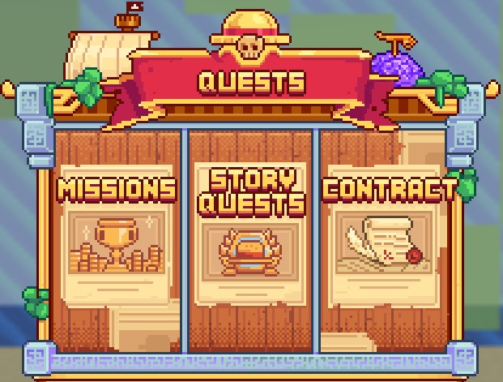
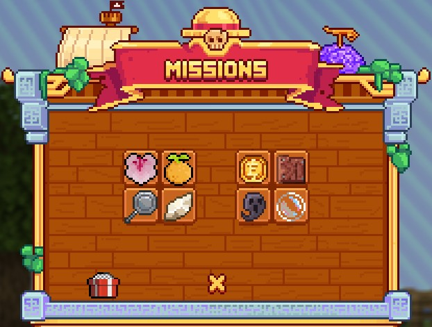

# 🗒️ Quests


**Earning Money on MinePiece**


During your adventure on <mark style="color:yellow;">**MinePiece**</mark>, you will encounter a variety of <mark style="color:yellow;">**quests**</mark> allowing you to <mark style="color:yellow;">**collect rewards**</mark> and <mark style="color:yellow;">**progress**</mark> through the different <mark style="color:orange;">**Adventure Islands**</mark> available.

## <mark style="color:orange;">**Story Quest**</mark>

The <mark style="color:yellow;">**`/quests`**</mark> menu offers several paths, starting with the <mark style="color:yellow;">**Story Quest**</mark>. It is designed to <mark style="color:yellow;">**accompany**</mark> you from the <mark style="color:yellow;">**beginning**</mark> of the server, facilitating your familiarization with the <mark style="color:orange;">**first Adventure Island**</mark>.

<figure><figcaption>
<strong>Menu</strong> <mark style="color:yellow;"><strong><code>/quests</code></strong></mark>
</figcaption></figure>

## <mark style="color:orange;">**Missions**</mark>

Once you have completed the <mark style="color:yellow;">**quests**</mark> in the "<mark style="color:yellow;">**Story Quest**</mark>" section, the quests of the <mark style="color:yellow;">**Adventure Islands**</mark> become <mark style="color:yellow;">**available**</mark> in the "<mark style="color:yellow;">**Missions**</mark>" tab.

<mark style="color:yellow;">**Each island**</mark> has its <mark style="color:yellow;">**own quests**</mark> to complete to <mark style="color:yellow;">**unlock the next rank**</mark> and thus access the next island.

The number of <mark style="color:yellow;">**missions**</mark> to unlock <mark style="color:yellow;">**varies**</mark> from one island to another, and <mark style="color:yellow;">**each unlocked missions**</mark> earns you <mark style="color:yellow;">**one or more rewards**</mark> specific to the quest.&#x20;

These <mark style="color:yellow;">**rewards**</mark> include <mark style="color:yellow;">**Berries**</mark>, in addition to the <mark style="color:yellow;">**island's currency**</mark>, and for the rarest quests, <mark style="color:yellow;">**access to the sale of certain items**</mark>.

<figure><figcaption>
<strong>Missions Menu</strong>
</figcaption></figure>

## <mark style="color:orange;">**Contracts**</mark>

You can also earn <mark style="color:yellow;">**rewards**</mark> through <mark style="color:yellow;">**contracts**</mark> available in:

* <mark style="color:yellow;">**Crates**</mark>
* <mark style="color:yellow;">**Vote Rewards**</mark>
* <mark style="color:yellow;">**Job Rewards**</mark>
* <mark style="color:yellow;">**Rewards**</mark>

These contracts are <mark style="color:yellow;">**special missions**</mark> that can <mark style="color:yellow;">**take place**</mark> either on your <mark style="color:yellow;">**island**</mark> or on <mark style="color:yellow;">**adventure islands**</mark>. <mark style="color:yellow;">**Successfully**</mark> completing these missions within the <mark style="color:yellow;">**specified time frame**</mark> will allow you to obtain <mark style="color:yellow;">**unique rewards**</mark>.

There are <mark style="color:yellow;">**different rarities**</mark> of contracts:

* <mark style="color:green;">**Easy Contract**</mark>
* <mark style="color:yellow;">**Advanced Contract**</mark>
* <mark style="color:blue;">**Hard Contract**</mark>
* <mark style="color:purple;">**Expert Contract**</mark>
* <mark style="color:red;">**Impossible Contract**</mark>

The <mark style="color:yellow;">**difficulty of contracts**</mark> is adjusted according to their <mark style="color:yellow;">**respective rarity**</mark>.


The quests in this section are not related to Battle Pass quests!

