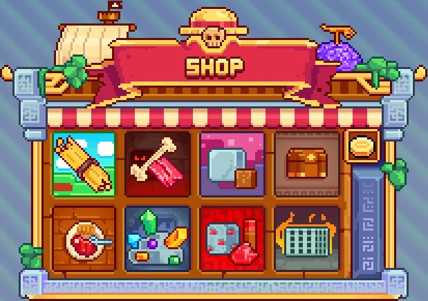

# 💰 Shops


**Earning Money on MinePiece**


## <mark style="color:orange;">General Shop</mark>

The <mark style="color:yellow;">**MinePiece**</mark> <mark style="color:yellow;">**`/shop`**</mark> lists a variety of <mark style="color:yellow;">**items**</mark> in <mark style="color:yellow;">**different categories**</mark>, allowing you to <mark style="color:yellow;">**buy**</mark> and <mark style="color:yellow;">**sell**</mark> <mark style="color:yellow;">**resources**</mark> without having to obtain them manually.

<figure><figcaption>
<mark style="color:yellow;"><strong><code>/shop</code></strong></mark> Menu
</figcaption></figure>

## <mark style="color:orange;">Categories</mark>

* <mark style="color:yellow;">**Farming**</mark>: Items related to agriculture, such as seeds, plants, and agricultural products.&#x20;
* <mark style="color:yellow;">**Mob Drops**</mark>: Items obtained by killing creatures.&#x20;
* <mark style="color:yellow;">**Blocks**</mark>: Different types of blocks for construction and decoration.&#x20;
* <mark style="color:yellow;">**Miscellaneous**</mark>: Various items, often useful in gameplay.&#x20;
* <mark style="color:yellow;">**Food**</mark>: Items to restore player health and saturation.&#x20;
* <mark style="color:yellow;">**Ores**</mark>: Mineral resources like iron, gold, diamond, etc.&#x20;
* <mark style="color:yellow;">**Redstone Components**</mark>: Redstone components for creating mechanisms.&#x20;
* <mark style="color:yellow;">**Spawners**</mark>: Creature generation blocks.


Some items available in the <mark style="color:yellow;">**`/shop`**</mark> are not directly sellable. They require <mark style="color:yellow;">**progressing**</mark> through different <mark style="color:yellow;">**adventure islands**</mark> to <mark style="color:yellow;">**gain access**</mark> to their <mark style="color:yellow;">**sale**</mark>.


## <mark style="color:orange;">Sales Chest</mark>

### <mark style="color:orange;">Creating a Sales Chest on Your Island</mark>&#x20;

If you want to <mark style="color:yellow;">**sell items**</mark> on your <mark style="color:yellow;">**island**</mark>, follow these simple steps to create a <mark style="color:yellow;">**sales chest**</mark>:

1. <mark style="color:yellow;">**Place a Chest**</mark>: Put a chest on your island at the desired location.
2. <mark style="color:yellow;">**Select the Item to Sell**</mark>: Hold the item you want to sell in your hand.
3. <mark style="color:yellow;">**Left-Click on the Chest**</mark>: Left-click on the chest you placed.
4. <mark style="color:yellow;">**Choose the Price**</mark>: In the chat, you will be prompted to specify the price in Berry for the item you want to sell.
5. <mark style="color:yellow;">**Sales Chest Created**</mark>: Once you've set the price, the sales chest will be created. Now, you can store the item you want to sell in this chest.

By following these steps, you can establish a <mark style="color:yellow;">**sales system**</mark> on your <mark style="color:yellow;">**island**</mark>, offering other players the opportunity to <mark style="color:yellow;">**buy the items you offer**</mark>.

<figure><figcaption>
<strong>Overview of Right-Clicking on the Sales Chest</strong>
</figcaption></figure>

## <mark style="color:orange;">Auction House</mark>

As for the server's <mark style="color:yellow;">**Custom Items**</mark>, they can be <mark style="color:yellow;">**bought**</mark> and <mark style="color:yellow;">**sold**</mark> through the <mark style="color:yellow;">**Auction House**</mark> interface. This interface is divided into <mark style="color:yellow;">**several sections**</mark>:&#x20;

* <mark style="color:yellow;">**Global**</mark>: Lists all items for sale in /ah, sorted by the date added.&#x20;
* <mark style="color:yellow;">**Blocks**</mark>: Section dedicated to blocks for sale.&#x20;
* <mark style="color:yellow;">**Weapons and Tools**</mark>: Groups weapons and tools available for purchase.&#x20;
* <mark style="color:yellow;">**Spawners**</mark>: Presents spawners available for sale.&#x20;
* <mark style="color:yellow;">**Pets**</mark>: Section dedicated to pet auctions.&#x20;
* <mark style="color:yellow;">**Devil Fruits**</mark>: Lists available Devil Fruits.

The <mark style="color:yellow;">**two buttons**</mark> on the <mark style="color:yellow;">**sides of the interface**</mark> allow players to <mark style="color:yellow;">**manage their sales**</mark> first and then <mark style="color:yellow;">**retrieve**</mark> <mark style="color:yellow;">**the items**</mark> they have <mark style="color:yellow;">**purchased**</mark>.

<figure><figcaption>
<mark style="color:yellow;"><strong><code>/ah</code></strong></mark><strong> Menu</strong>
</figcaption></figure>
